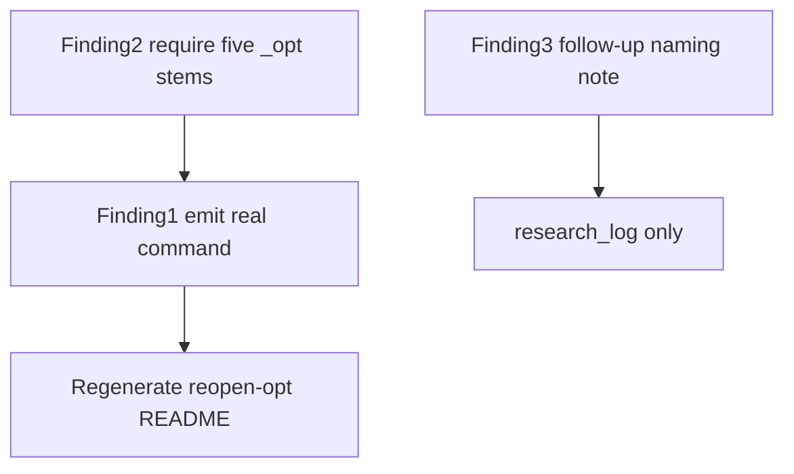

# Analysis README command and `_opt` selection

Do **not** edit [`results/analysis/pair-bound/2026-08-17-reopen-opt/README.md`](results/analysis/pair-bound/2026-08-17-reopen-opt/README.md) by hand. After the code change, regenerate it with `python -m sfbds_compare.analysis ... --force` and the same five `--experiment` flags.

No new studies. Citation stays: maze and nested 64@30% from this slug; do not cite nested p-values from the 2026-08-17 NoReopen snapshots.



## Finding 1 — generated command must match the run (do this)

Today [`report.py`](src/sfbds_compare/analysis/report.py) always prints:

```bash
python -m sfbds_compare.analysis --input-dir results/study/pair-bound --out-dir results/analysis/pair-bound/<run-name>
```

That now hits the mix-refuse on `results/study/pair-bound/` (ten CSVs).

**Change**

- Thread `input_dir`, `out_dir`, and the filtered experiment names (the `--experiment` list actually used, or the distinct names in `paired` if unfiltered) into `render_readme` / `write_readme`.
- Emit those `--experiment` flags when the run was filtered. If unfiltered, keep a command without `--experiment`, plus one sentence: select only `*_opt` names or only pre-fix names when the folder contains both.
- Prefer the CLI’s `--experiment` values over “names present in paired.csv” so a filter that matched nothing is not silently rewritten (empty already exits 1).
- Also emit `--allow-opt-subset` when that flag was used (follow-up `*_opt` slices). Do not emit it on the five-stem official baseline.

**Tests**

- `render_readme(..., experiments=["study_maze_127_opt", ...])` contains those flags and does not contain the bare unfiltered command as the only recipe.
- CLI test: run with `--experiment study_maze_127_opt` (under `--allow-opt-subset` if finding 2 lands) and assert the generated README includes that flag.

## Finding 2 — official `_opt` baseline is all five stems (include)

The mix check only forbids mixing suffix and non-suffix. `--experiment study_maze_127_opt` alone is legal today.

**Change**

- Frozen set of the five official stems: `study_corridor_512_opt`, `study_maze_127_opt`, `study_open_128_opt`, `study_random_64_opt`, `study_random_128_opt`.
- After `--experiment` filter: if **any** remaining name ends with `_opt` and `--allow-opt-subset` is not set, require that the `_opt` names in the run **equal** that set (all five present, no extra `*_opt`).
- `--allow-opt-subset` is the documented escape for a later maze-only or maze-255 `*_opt` slice. Default off.
- Later lock: `--allow-opt-subset` is follow-up-only. If the run intersects the official five and is not exactly that set (five + extras, or a partial official set), refuse even with the flag. Maze-255 live configs are `study_*_opt.yaml`; non-`_opt` follow-ups are in `configs/followup/retired/`.

**Tests**

- Five `_opt` names → 0.
- Only `study_maze_127_opt` → 1 unless `--allow-opt-subset`.
- Pre-fix-only names (no `_opt`) → still 0.
- Mix pre-fix + `_opt` → still 1 (existing test).

## Finding 3 — suffix is a convention (log only)

Keep `_opt` for this restart. Do not invent an allow-list of all future names.

Follow-ups (maze 255 / denser random): either keep the `_opt` suffix **and** pass `--experiment` (with `--allow-opt-subset` if not the five-stem set), or use a new stem in `results/study/pair-bound/` and pass `--experiment` explicitly. A name like `study_maze_127_opt2` is not a third formula; treat it as a mistake.

One timeline sentence in [`docs/research_log.md`](docs/research_log.md) and [`results/analysis/pair-bound/research_log.md`](results/analysis/pair-bound/research_log.md). No new analysis slug besides regenerating `2026-08-17-reopen-opt` README (same folder, `--force`, code-only refresh of the command block).

## Out of scope

- Maze 255 / denser random studies.
- Late-stop proof.
- Hand-editing generated README tables.
