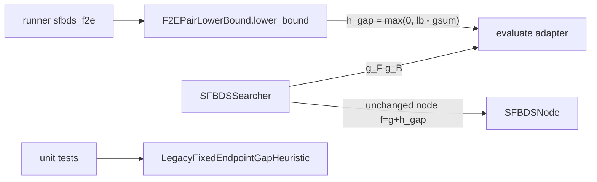

# Corrected SFBDS F2E

Do not overwrite [`results/study/legacy/`](results/study/legacy/) or existing [`results/pilot/legacy/`](results/pilot/legacy/) filenames. Do not run the 64/128 study matrix. New pair-bound output goes to `results/study/pair-bound/` and `results/pilot/pair-bound/`.

## What is wrong today

[`F2EFixedEndpointHeuristic`](src/sfbds_compare/heuristics/f2e.py) is already documented as a **project-choice gap**, not canonical F2E:

```
h_gap(x,y) = max(|MD(x,G)-MD(y,G)|, |MD(S,x)-MD(S,y)|)
f = g_F + g_B + h_gap   # SFBDSNode
```

[`PairHeuristic.evaluate`](src/sfbds_compare/heuristics/base.py) and both call sites in [`sfbds.py`](src/sfbds_compare/search/sfbds.py) (root ~68, child ~157) pass only `(forward, backward, problem)` — **no g**. [`runner.py`](src/sfbds_compare/experiments/runner.py) wires `sfbds_f2e` to this class. Every study CSV and analysis snapshot used this gap; treat them as **legacy**, not corrected F2E.

Do not drop NBS `lb` into `h_gap`. `lb` bounds **solution cost through the pair**; SFBDS OPEN stores **remaining** cost.

## Corrected F2E is a pair lower bound (unit grids, epsilon=1)

Primary formula (class method `lower_bound`; tests assert this):

```
if u == v:  lb = g_F + g_B                         # Late goal; no +epsilon
else:       lb = max(g_F + MD(u,G), g_B + MD(S,v), g_F + g_B + 1)
          = max(f_F, f_B, gsum+1)
```

Meeting must **not** use `+1`. Otherwise Late-goal pairs get `lb = g+1` and can be delayed vs true cost.

## Remaining-cost adapter — needed, but small

[`SFBDSNode`](src/sfbds_compare/search/nodes.py) is `f = g_F + g_B + h_gap`. TBh, OPEN, duplicate/`g` checks, F2F, A*, analysis all assume that. Replacing `h_gap` with `lb` on the node would be the expensive path (nodes, [`tie_break.py`](src/sfbds_compare/policies/tie_break.py), many unit tests). **Do not do that.**

Necessary adapter (one line, at `PairHeuristic.evaluate` on the F2E class — not a searcher rewrite):

```
h_gap = max(0, lb − g_F − g_B)
# u ≠ v:  max(MD(u,G)−g_B, MD(S,v)−g_F, 1)
# u == v: 0
```

**Change cost: small.** Same files as a gap-rewrite. Extra vs “h_gap-only”: a `lower_bound` method + tests that treat `lb` as source of truth.

Touch: [`f2e.py`](src/sfbds_compare/heuristics/f2e.py), optional protocol in [`base.py`](src/sfbds_compare/heuristics/base.py), two call sites in [`sfbds.py`](src/sfbds_compare/search/sfbds.py) to pass `g`, [`runner.py`](src/sfbds_compare/experiments/runner.py), `__init__.py`, tests, docs.

Do not touch: `SFBDSNode` fields, TBh, direction/Late/duplicates, A*, analysis, study CSVs.

## Architecture (minimal)

- Optional protocol `PairLowerBound.lower_bound(..., g_F, g_B) -> lb`. Official class: `F2EPairLowerBound` (name it as a bound, not a gap heuristic).
- That class also implements `PairHeuristic.evaluate` as the adapter so `SFBDSSearcher` stays typed as `PairHeuristic`. Extend `evaluate(..., g_F=0.0, g_B=0.0)`. F2F and legacy ignore `g`.
- Pass `g` from the searcher (already on the node / provisional child). **Every** `PairHeuristic.evaluate` must accept `g_F`/`g_B` (defaults OK). F2F and legacy ignore the values but must not TypeError. Call sites: [`f2f.py`](src/sfbds_compare/heuristics/f2f.py), legacy class, protocol in [`base.py`](src/sfbds_compare/heuristics/base.py).
- **No alias** for `F2EFixedEndpointHeuristic`. Rename to `LegacyFixedEndpointGapHeuristic`. Update exports in [`heuristics/__init__.py`](src/sfbds_compare/heuristics/__init__.py), [`runner.py`](src/sfbds_compare/experiments/runner.py), [`test_heuristics.py`](tests/unit/test_heuristics.py), [`test_heuristic_properties.py`](tests/integration/test_heuristic_properties.py), [`test_cost_agreement.py`](tests/integration/test_cost_agreement.py), [`test_sfbds.py`](tests/unit/test_sfbds.py).
- Optional YAML `sfbds_f2e_legacy` is **not** in this pass.
- `max(0, lb − gsum)` is a safety clip. For `u ≠ v`, `lb ≥ gsum+1` so the clip does not fire. Tests should still assert the three-term `lower_bound` first.



## Implementation sequence

1. **Audit** in [`docs/research_log.md`](docs/research_log.md): old formula, call sites, tests that lock the gap (`test_f2e_hand_formula`, Lipschitz / gap≤MD in [`test_heuristic_properties.py`](tests/integration/test_heuristic_properties.py)). Same turn as code is fine.
2. Rename gap class; retarget those numeric tests to **legacy**. Lipschitz / gap≤MD are properties of the old formula — do not require them of the corrected bound.
3. Implement `F2EPairLowerBound.lower_bound` as the documented formula; `evaluate` only adapts to remaining cost. Wire runner + [`heuristics/__init__.py`](src/sfbds_compare/heuristics/__init__.py). Cost-agreement tests keep using the official class.
4. **New tests** assert `lower_bound` first, then that `evaluate == max(0, lb-gsum)`:
   - three cases where `f_F`, `f_B`, and `gsum+1` each uniquely dominate
   - meeting `lb = gsum` / `h_gap = 0`
   - `epsilon=1` on the third term when `u ≠ v`
   - optimality vs A* on a small maze
   - a spy/fake heuristic proving **both** SFBDS `evaluate` call sites pass the child's `g_F`/`g_B` (missing kwargs would silently use 0 and the bound would be wrong)
5. Short note in the F2E docstring: on 4-connected unit grids, `h_F(u)=MD(u,G)` and `h_B(v)=MD(S,v)`.
6. Full `pytest`. Then **new-stem** pilots: copy [`configs/pilot/`](configs/pilot/) YAMLs and change the YAML `name` (that is the CSV stem), e.g. `pilot_corridor_lb_f2e`. Never reuse `pilot_corridor`. Run **maze** as well as corridor/open — corridor often ties F2F vs F2E on expansions. Check A*/F2F/corrected-F2E **cost** agreement.
7. Docs: pair-`f` bullet in [`docs/project_definition.md`](docs/project_definition.md); module docstring; research log locked methodology: previous F2E CSVs are legacy gap; regenerate study only **after approval**, not in this pass.

## Honest course cites (for the log / report-back)

- Slide 14 — F2E **heuristics** `h_F(u)=h(u,goal)`, `h_B(v)=h(start,v)` (not the pair max).
- Slide 21 — MM **stop** uses `gminF+gminB+e` (stopping LB, not SFBDS `h_gap`).
- NBS/MEP — `lb=max(f_F,f_B,g_F+g_B)`; instructor adds `epsilon` on the third term.
- Slides 73–76 — knowing epsilon / GMXe with `ε=1`.

## Do not

- Run or overwrite the study matrix; do not treat existing analysis READMEs as corrected-F2E results.
- Put analysis CSVs at `results/analysis/` root (or at `results/analysis/legacy/` / `results/analysis/pair-bound/` without a dated slug).

## Judge (2026-08-17)

Adapter `h_gap = max(0, lb − gsum)` with meeting `lb = gsum` is the right mapping into existing `SFBDSNode.f`. Do not rewrite OPEN/TBh.

**Locked after review**

- F2F (and every pair `evaluate`) must take `g_F`/`g_B` once the searcher passes them.
- Spy test that both SFBDS call sites pass `g` (default 0 is a silent bug). On the 1×4 corridor (BF tie → Forward), first child must be `(g_F, g_B) == (1.0, 0.0)` so swapped kwargs fail.
- Pilot YAML `name` is the stem; maze pilot required.
- Rename import list includes `__init__.py` and `test_sfbds.py`.
