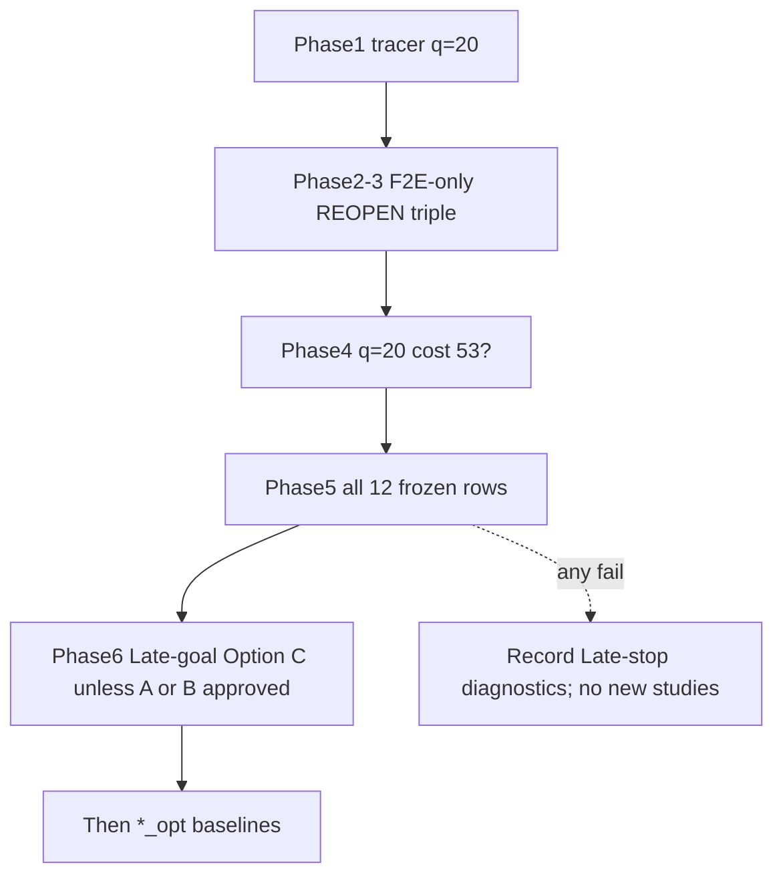

# F2E optimality gate (updated implementation plan)

Do **not implement** until this plan is reviewed and approved. No new official studies. Do not overwrite [`results/study/legacy/`](results/study/legacy/) or current [`results/study/pair-bound/study_*.csv`](results/study/pair-bound/) stems.

**Hard constraints**

- Do not change the F2E meeting lower bound (`u=v` ⇒ `lb = gsum`). Do not implement `meeting lb = gsum+1`.
- Do not replace F2E with `h_gap=1` off meeting.
- Pathmax is out (cannot resurrect a discarded branch after CLOSE).
- Do not declare optimality fixed from q=20 alone.
- Do not write that reopen “preserves optimality” in general until Phase 6 is settled.
- F2F policy and expansion baseline stay NoReopen.

**Default for Late-goal + reopen (Phase 6):** Option C (empirical gate). Option A (proof) or Option B (incumbent stop) only after a separate approval. Do not implement Option B in this pass.

## Diagnosed facts (q=20)

Instance: [`configs/study/study_random_64.yaml`](configs/study/study_random_64.yaml) query 20, 1228 obstacles, hash `d604ed0b69115ce9`. A*=53, F2F=53, F2E=57.

- F2E CLOSED `((47,35),(57,51))` at g=29, later candidate g=27 discarded; 27 equals F2F’s g on that key.
- F2E never generated `(m,m)` at g=53; only meeting was g=57.
- `h_gap` depends on `g_F`/`g_B`, so `(u,v)` is not a consistent A* duplicate key. Tree Lipschitz 0 on generated edges does not contradict that.
- Bound formula is not the demonstrated bug.

Reopen-on-better-g is a **plausible, likely necessary** repair. It is **not** proven sufficient with current Late-stop (first selected meeting, `f=g`).

## Phase 1 — Reproducible diagnosis (before search changes)

Add a fixture/tracer in [`tests/integration/test_cost_agreement.py`](tests/integration/test_cost_agreement.py) (helper next to `_study_random_64_q20_d1228`). Distinguish **generated child / pushed child / selected-expanded / CLOSED better-g discard**.

Lock (pre-fix, NoReopen):

- F2F CLOSED better-g discards == 0.
- F2E: CLOSED g=29 then candidate g=27 on `((47,35),(57,51))`.
- Discarded 27 equals F2F’s g on that key.
- F2E generates no `(x,x)` with g=53.

Do **not** lock F2E cost 57 as permanent expected behavior.

Also: one clause in the older [`docs/research_log.md`](docs/research_log.md) cost-clean-tests diagnosis: that sentence was the **hypothesis at the time**; demonstrated in the 2026-08-17 q=20 optimality-diagnosis entry.

## Phase 2 — Real F2E-only reopen (not ordinary PUSH)

A naive `decide_closed` → `PUSH` is a silent no-op: [`sfbds.py`](src/sfbds_compare/search/sfbds.py) lines 117–118 skip if `closed.contains(pair_key)`.

Required triple:

1. Distinct action: `PathAction.REOPEN` in [`policies/types.py`](src/sfbds_compare/policies/types.py). `g >= closed.g` → `DISCARD`; `g < closed.g` → `REOPEN`. Equal-g discard.
2. [`ClosedSet.remove`](src/sfbds_compare/structures/closed_set.py).
3. Searcher: on `REOPEN`, `closed.remove` then `open_list.push`, so a later pop is not skipped at line 117.

Keep OPEN replacement / lazy stale entries unless a test shows they must change.

## Phase 3 — F2F unchanged

Do **not** change [`default_policies()`](src/sfbds_compare/policies/__init__.py) (stays `NoReopenPolicy`).

Inject reopen only on the F2E searcher in [`runner.py`](src/sfbds_compare/experiments/runner.py) (~118: `SFBDSSearcher(F2EPairLowerBound())`). F2F (~114) stays `SFBDSSearcher(F2FManhattanHeuristic())` with defaults.

Tests that construct `SFBDSSearcher(F2EPairLowerBound())` without policies (including q=20 xfail) must pass the same F2E bundle as the runner, or a shared `f2e_policies()` helper used by both.

Regression: F2F on q=20 still has zero CLOSED better-g reopen pushes.

## Phase 4 — Immediate repair

Replay q=20: g=27 on that pair is resurrected and **expanded**. If and only if F2E==A*==53, remove the strict xfail. Meeting evaluate stays 0 (no +1).

## Phase 5 — Gate on all 12 frozen mismatch rows

Freeze rows as `(experiment, query_index, obstacle_count, map_hash)` from pre-fix [`results/study/pair-bound/`](results/study/pair-bound/) (not 12 query indexes). Replay via `_problems_for_query` + obstacle count; assert fingerprint; `F2E_cost == A*_cost`.

Any remaining failure: **no new experiments**, optimality not declared fixed. Record: first selected meeting cost; best incumbent meeting cost if several generated; min OPEN `f`/`lb` when the meeting is selected; whether a cheaper pair is found later; whether better CLOSED g was reopened successfully.

## Phase 6 — Late-goal separately (do not mix into the reopen claim)

Current: select `(m,m)`, stop immediately, meeting `f=g`.

- **Option A:** Proof that with this `lb`, better-g reopen, and current duplicates, the first selected meeting has `g=C*`. Must address why a suboptimal meeting cannot be min-`f` while a not-yet-generated cheaper meeting still exists. “Standard A* reopen” is not the proof.
- **Option B:** Incumbent `U`, continue while OPEN can beat `U` (`f_min >= U` or the correct analogue). Do **not** implement without a bound-semantics check and tests, and not in this pass unless separately approved.
- **Option C (this pass):** Log wording only:

  > Reopen is the hypothesized repair for the demonstrated duplicate-key failure. It is empirically accepted only if all 12 frozen mismatches match A*. This is not yet a general proof of optimality.

## Exact files / symbols

| File | Change |
| --- | --- |
| [`tests/integration/test_cost_agreement.py`](tests/integration/test_cost_agreement.py) | Tracer + q=20 locks + 12-row gate + F2F NoReopen; drop xfail only after cost 53 |
| [`docs/research_log.md`](docs/research_log.md) | Hypothesis vs demonstrated vs not proven; older entry clause |
| [`results/analysis/pair-bound/research_log.md`](results/analysis/pair-bound/research_log.md) | Same wording |
| [`src/sfbds_compare/policies/types.py`](src/sfbds_compare/policies/types.py) | `PathAction.REOPEN` |
| [`src/sfbds_compare/policies/reopen.py`](src/sfbds_compare/policies/reopen.py) | `BetterGReopenPolicy.decide_closed` |
| [`src/sfbds_compare/policies/__init__.py`](src/sfbds_compare/policies/__init__.py) | Export + `f2e_policies()`; **do not** alter `default_policies()` reopen |
| [`src/sfbds_compare/structures/closed_set.py`](src/sfbds_compare/structures/closed_set.py) | `remove` |
| [`src/sfbds_compare/search/sfbds.py`](src/sfbds_compare/search/sfbds.py) | Handle `REOPEN` (remove then push); leave Late-on-first-meeting |
| [`src/sfbds_compare/policies/better_path.py`](src/sfbds_compare/policies/better_path.py) | CLOSED still delegates to reopen; no PUSH-from-CLOSED |
| [`src/sfbds_compare/experiments/runner.py`](src/sfbds_compare/experiments/runner.py) | F2E searcher uses `f2e_policies()` |
| [`src/sfbds_compare/heuristics/f2e.py`](src/sfbds_compare/heuristics/f2e.py) | **No formula change** |
| Tests: [`tests/unit/`](tests/unit/) new or extended (`test_sfbds.py` / policies) | CLOSED worse/equal discard; better → REOPEN; remove-before-push; pop expands; meeting h=0 |

Do not touch F2E `lower_bound` meeting branch. Do not run maze-255 / denser-random / `*_opt` studies until Phase 5 passes.

## After the gate (unchanged)

New YAML stems `study_*_opt` into `results/study/pair-bound/` without deleting pre-fix CSVs. Analysis **must** pass `--experiment` for all five `_opt` names. New analysis slug.
