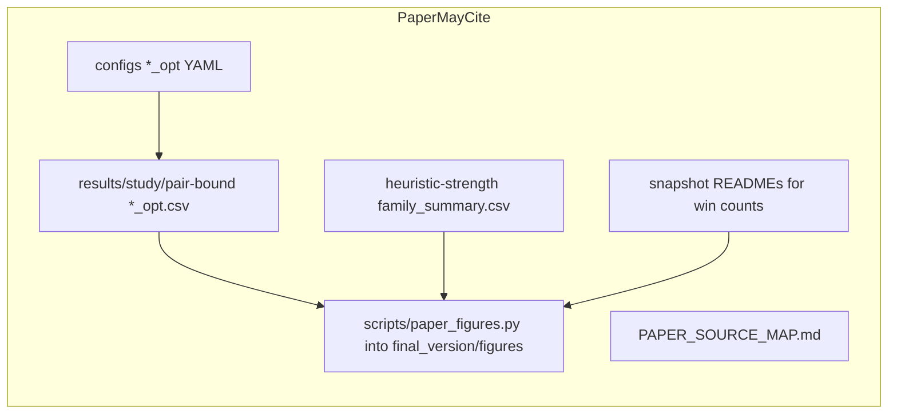

# Final Report Construction Plan

Phase 0–1 are **done**. The skeleton uses the course’s four parts (§2). Next gate is **Phase 2** (Methodology: Search Algorithm + Heuristics). Do not rebuild the Phase 0 dummy. Do not start Related Work or Results yet. [`PAPER_SOURCE_MAP.md`](docs/context/final_report_papers/PAPER_SOURCE_MAP.md) is the only citation spec. Do not modify [`docs/final_report/AuthorKit27`](docs/final_report/AuthorKit27).

---

## Writing rule: legacy F2E is invisible

The final report presents **one** SFBDS-F2E: the official pair lower bound plus the official better-g CLOSED reopen policy, as used in the `*_opt` experiments.

**Forbidden in every compiled report file** (Abstract, Introduction and Literature Review, Methodology, Experimental Results, Experimental Conclusions and Summary, Appendix, captions, footnotes):

- mentioning legacy gap-F2E, “two F2E eras,” or that a different F2E was implemented first
- legacy formulas, class names (`LegacyFixedEndpointGapHeuristic` or any gap-heuristic name), numbers, figures, or experiment history
- NoReopen pair-bound CSVs / snapshots as results, or a bug-fix narrative about 12 cost mismatches

**Allowed internally only** (never compiled): [`docs/final_report/final_version/notes/source_map.md`](docs/final_report/final_version/notes/source_map.md) may list excluded paths with the label **EXCLUDED FROM FINAL REPORT — never use as evidence.**

In the paper, official F2E is simply the implemented algorithm. Reopen is described as part of that algorithm (the remaining-cost adapter is not consistent on the pair key `(u,v)`), not as a later repair. Cost agreement with A* is a **validity result**, not a history of a prior failure.

---

## 1. Exact submission requirements

**Authoritative course source:** [`docs/context/Project_Instructions_context.md`](docs/context/Project_Instructions_context.md) (translation of the 2-page Hebrew `instructions.pdf`; the PDF itself is **not** in the repo).

The course requires a **practical research laboratory report**, submitted **in pairs**, that:

- states a search research question, describes implementation/experiments, analyzes results, and draws conclusions (§1.1, §2);
- includes a **link to the code used for experiments and graphs** (§7, §12.6);
- is academically written, clearly structured, and consistently cited (§8.3).

**Four central parts** (§2), with grading emphases:

1. **Introduction and literature review** (§3)
2. **Methodology** (§4)
3. **Experimental results** (§5)
4. **Experimental conclusions and summary** (§6) — shorter than the other parts

Structure is **flexible** (§1.4) if those four functions remain clear.

**Format:** recommended **AAAI’27 camera-ready style** (§8.1). Use `\nocopyright` (§8.2, §12.6). No course page limit, keywords, or reproducibility checklist. An abstract is required by the AAAI template. Keywords are not in the 2027 kit.

**Course research question** (§6.5 interpretation):

> Under which grid and heuristic conditions does Front-to-Front provide enough search reduction to justify its additional computational cost compared with Front-to-End?

**How we answer it:** pair expansions are primary; runtime / eval-cost are secondary. On Manhattan grids the extra F2F cost largely did not appear. That answers §6.5 for this setting; it does not claim “F2F is faster in general.”

**Secondary metrics:** `generated` and `peak_open` exist in official `results/study/pair-bound/*_opt.csv` (in git). Extract a compact table in Phase 5 via `scripts/paper_figures.py`. Do not depend on gitignored analysis `paired.csv`. Do not run new search.

---

## 2. Exact AAAI template decision

**Kit:** [`docs/final_report/AuthorKit27`](docs/final_report/AuthorKit27). Do not copy from the duplicate `docs/AuthorKit27`.

**Basis:** [`CameraReady2027.tex`](docs/final_report/AuthorKit27/CameraReady2027.tex) preamble/skeleton, not Anonymous.

- `\usepackage{aaai2027}` **without** `[submission]` (that option hides authors)
- Add `\nocopyright` after loading the style (course overrides AAAI’s publication ban on that command)
- Skip ReproducibilityChecklist, Word/, example figures, example `aaai2027.bib`

**Build:** PDFLaTeX only; natbib + `aaai2027.bst` (no `\bibliographystyle` in the document); `pdflatex` → `bibtex` → `pdflatex` × 2. No `hyperref`. Code link in the AAAI `links` environment between abstract and body. Figures via matplotlib PDF/PNG (`pgfplots` forbidden). Optional `booktabs` and `algorithm`/`algorithmic`. `\setcounter{secnumdepth}{2}`.

**Draft with `\input{sections/...}`** for gated review; flatten later only if desired. No page-count lock. End matter: `\bibliography{references}` **then** `\appendix` so References stays unnumbered and the appendix does not become “Appendix B.”

**Copy in Phase 0:** `aaai2027.sty`, `aaai2027.bst`, rewritten `main.tex`. Do not copy instruction PDFs or Anonymous files.

---

## 3. Final proposed report outline

Course four parts ([`Project_Instructions_context.md`](docs/context/Project_Instructions_context.md) §2–§6). AAAI supplies Abstract + `links` (code URL) + unnumbered References. Optional appendix after References.

**Title (working, Title Case):** *Comparing Front-to-Front and Front-to-End Heuristics inside Single-Frontier Bidirectional Search on Grids*

**Authors:** placeholders until names/emails/affiliation are supplied.

### Abstract (write last)

F2F vs **official SFBDS-F2E** (pair lower bound + reopen) inside one SFBDS; pair expansions primary; maze 22/30 and 26/30; median saving ~3.8%; open/corridor ties; costs agree with A* on tested instances (empirical, not a proof). No legacy, no “two eras,” no “F2F is faster.”

### 1. Introduction and Literature Review (course §3)

Subsections: Background; Motivation; Problem and Research Objective; Related Work; Contribution. Analyze, do not list. Cite **verified primary papers only**. Do not mention any project-internal F2E history. RQ: *On which grid families does F2F expand fewer pairs than SFBDS-F2E, and does that reduction justify extra heuristic cost on this cheap-\(h\) domain?*

### 2. Methodology (course §4)

Subsections: Search Algorithm; Heuristics; Domain and Instances; Search Mechanics; Metrics; Experimental Protocol.

Present the **current official implementation only** (Phase 2 fills Algorithm + Heuristics from code):

- F2F: \(h(u,v)=\mathrm{MD}(u,v)\) — [`src/sfbds_compare/heuristics/f2f.py`](src/sfbds_compare/heuristics/f2f.py)
- F2E LB: \(u=v \Rightarrow g_F+g_B\); else \(\max(g_F+\mathrm{MD}(u,G), g_B+\mathrm{MD}(S,v), g_F+g_B+1)\); OPEN remaining cost \(\max(0,\mathrm{lb}-g_F-g_B)\) — [`src/sfbds_compare/heuristics/f2e.py`](src/sfbds_compare/heuristics/f2e.py)
- Official F2E search: `official_f2e_searcher()` = that bound + `f2e_policies()` (`BetterGReopenPolicy`) — [`src/sfbds_compare/search/sfbds.py`](src/sfbds_compare/search/sfbds.py)
- F2F: `default_policies()` / `NoReopenPolicy` (state this as the F2F policy set, not as “F2E used to be NoReopen”)
- Shared: Late goal-on-select, ordered-pair duplicates, TBh, branching-factor direction
- A*: Late, NoReopen, Manhattan; **state** expansions, not pairs

Do not name or formula-define any other F2E. Attribute formulas **only** as in [`PAPER_SOURCE_MAP.md`](docs/context/final_report_papers/PAPER_SOURCE_MAP.md): Chen 2017 path-pair \(\mathrm{lb}=\max(f_F,f_B,c(U)+c(V))\) (no \(\varepsilon\)); Siag SoCS/IJCAI 2023 \(\mathrm{lb}_E=\max(f_F,f_B,g_F+g_B+\varepsilon)\). Never write “NBS \(+1\)”.

Official `*_opt` matrix only. Generators, seeds, pairing, Wilcoxon/sign/Holm, cost-mismatch exclusion as a **protocol**, hardware.

### 3. Experimental Results (course §5)

Geography then factors then secondary cost. Analysis of the figures lives here (course §5.3), not a separate Discussion chapter. Keep three settings distinct: (1) two-frontier F2F that mins over the opposite OPEN (Siag SoCS); (2) SFBDS pairwise eval (Felner 2010); (3) our cheap Manhattan plus the offline eval-cost sweep. Forbidden collapse: “Siag found F2F expensive; we found F2F cheap.” Keep “does not refute Siag.”

### 4. Experimental Conclusions and Summary (course §6; shorter)

Answer the §6.5 question by condition. Limitations without historical F2E. Future work may say pair-cache / Late-stop proof / expensive \(h\) were **not implemented**, with **no Felner cache cite** and no Lippi cite.

### Appendix

Extra nested rows, eval-cost, heuristic-strength details, secondary metrics. Still no legacy.

---

## 4. Source map

### PRIMARY (paper evidence)

- Course contract: [`docs/context/Project_Instructions_context.md`](docs/context/Project_Instructions_context.md)
- Locked science: [`docs/research_log.md`](docs/research_log.md), [`results/analysis/pair-bound/research_log.md`](results/analysis/pair-bound/research_log.md), [`results/analysis/README.md`](results/analysis/README.md) — **use numbers from official snapshots; do not copy historical-era sentences into the paper**
- Implementation: `official_f2e_searcher`, `F2EPairLowerBound`, `F2FManhattanHeuristic`, policies, A*, generators, metrics
- Official configs: `configs/study/study_*_opt.yaml`; live `configs/followup/study_*_opt.yaml`
- Official CSVs: `results/study/pair-bound/*_opt.csv` only
- Citable snapshots:
  - [`2026-08-17-reopen-opt`](results/analysis/pair-bound/2026-08-17-reopen-opt/)
  - [`2026-08-17-harder-opt`](results/analysis/pair-bound/2026-08-17-harder-opt/)
  - [`2026-08-17-far-braid-by-experiment`](results/analysis/pair-bound/2026-08-17-far-braid-by-experiment/)
- Secondary: [`2026-08-17-heuristic-strength`](results/analysis/pair-bound/2026-08-17-heuristic-strength/), [`2026-08-17-eval-cost-sensitivity`](results/analysis/pair-bound/2026-08-17-eval-cost-sensitivity/)
- Verified papers: [`docs/context/final_report_papers/PAPER_SOURCE_MAP.md`](docs/context/final_report_papers/PAPER_SOURCE_MAP.md) (only citation spec; PDFs already in that folder)

### SECONDARY (supporting, not citation authority)

- Literature **Markdown notes** under [`docs/context/sfbds_literature_context_md/`](docs/context/sfbds_literature_context_md/) — **navigation only**
- Lecture summaries under [`docs/context/presentations_summary/`](docs/context/presentations_summary/) — methodology language only; not bibliography
- [`docs/project_definition.md`](docs/project_definition.md) — topic map; Idea B cache was **not** implemented
- Analysis PNGs under `results/analysis/` — **gitignored**; do not treat snapshot folders as figure inputs
- `generated` / `peak_open` columns in git `results/study/pair-bound/*_opt.csv` (Phase 5 extracts these; do not require analysis `paired.csv`)

### EXCLUDED FROM FINAL REPORT — never use as evidence

Record these only in `final_version/notes/source_map.md`:

- `results/study/legacy/`, `results/analysis/legacy/`, `results/pilot/legacy/`
- `LegacyFixedEndpointGapHeuristic` and all gap-F2E numbers/figures
- Pair-bound CSVs **without** `_opt` (NoReopen)
- Snapshots: `2026-08-17-baseline-study`, `cost-clean-tests`, `cost-clean-plots`
- `2026-08-17-far-braid-opt` pooled README (use `far-braid-by-experiment`)
- Non-`_opt` follow-up YAMLs / `configs/followup/retired/`
- Pooled nested-random / pooled maze-across-experiments / all-query Spearman / nested 64@30% Spearman **0.86 (n=13)** as a savings ranking / “F2F is faster” as a general claim

---

## 5. Claim–evidence matrix

- **F2F expands fewer pairs on perfect mazes** — reopen-opt maze 127 **22/30**, Holm p≈4.77e-07, median saving **3.8%**; harder-opt maze 255 **26/30**, Holm p≈2.98e-08, median saving **3.8%**. High.

- **Open and corridor are essentially all ties** — reopen-opt open 128 and corridor 512: **0/30** untied. High at these sizes. Do not say “F2F never helps.”

- **Nested random is weaker, density- and seed-dependent** — reopen-opt 64@30% seed 110: **13/30**; harder-opt seed 210: 64@40% **16/30**, 64@45% **14/1/15**, 128@45% **11/30**. Do not pool seeds. Nested 30% vs 45% are not paired maps. Medium.

- **Braiding reduces the F2F advantage** — far-braid-by-experiment: 127 braid **12/30** vs 22/30; 255 braid **11/30** vs 26/30. High for these generators.

- **Longer Manhattan at fixed maze 127 did not strengthen the effect** — far-opt **15/30** vs 22/30. High for this generator/seed.

- **On official `*_opt` instances, F2F, F2E, and A* agree on solution cost** — 0 mismatches in the three citable snapshots. Empirical coverage only; not a general optimality theorem. Do not narrate a prior mismatch set.

- **Official F2E uses better-g CLOSED reopen** — implementation fact (`f2e_policies()`). Paper motivation: remaining-cost \(h_{\mathrm{gap}}\) is not consistent on `(u,v)`. Do not present this as a post-hoc bug fix.

- **Heuristic-strength partially explains expansions** — heuristic-strength README; F2E never strictly stronger on recorded `evaluate()` pairs; nested 45% q=8 counterexample. Mechanism only. **Ban citing Spearman as a savings ranking:** all-query Spearman *and* nested 64@30% **0.86 (n=13)** (those 13 queries are already F2F-fewer). Honest ranking number: maze 255 **0.13**.

- **F2F is faster** — **not a main claim.** Timed maze 127 only: 22/22 untied, median ratio **0.885**. Eval-cost: no crossover, secondary.

- **§6.5 cost justification on this domain** — F2F never had more `heuristic_evals` on the three eval-cost families; timed maze slightly favored F2F. Does not refute Siag et al. on expensive two-frontier F2F.

- **Generated / peak_open** — extract in Phase 5. Do not invent numbers.

- **Cache shifts the runtime crossover** — not done. Future work only: say it was **not implemented**. **No Felner 2010 cache cite** (caching is not in the verified map claims). No Lippi cite.

---

## 6. Figure and table plan

**Do not look in snapshot folders for `paired.csv`.** Analysis CSVs/PNGs under `results/analysis/` are gitignored; `2026-08-17-reopen-opt/` is README-only. A clean clone cannot build Figure 3 or a `generated`/`peak_open` table from those folders.

**Phase 5 deliverable:** [`scripts/paper_figures.py`](scripts/paper_figures.py) (course §7 graph-prep code). Write paper figures into [`docs/final_report/final_version/figures/`](docs/final_report/final_version/figures/).

**Inputs in git**

- `results/study/pair-bound/*_opt.csv` — expansions, `generated`, `peak_open`, runtime, costs
- Committed [`family_summary.csv`](results/analysis/pair-bound/2026-08-17-heuristic-strength/family_summary.csv) (gitignore exception)
- Snapshot READMEs for headline win counts only (not as plot data)

**Rebuild if needed.** `paper_figures.py` may call `python -m sfbds_compare.analysis` with `--input-dir results/study/pair-bound` and `--out-dir` **under** `docs/final_report/final_version/` (not `results/analysis/`). Use `--experiment` / `--allow-opt-subset` the same way the citable snapshots did. Optional eval-cost curve: re-run `scripts/eval_cost_sensitivity.py` into `final_version/figures/`, not the gitignored snapshot folder.

**Sanity after rebuild:** maze 127 still **22/30**, maze 255 still **26/30**.

Main minimum: instance matrix; headline expansions; maze scatter; maze-factor table; heuristic-strength share figure from `family_summary.csv`.

Optional/appendix: eval-cost curve; generated/peak_open table from study CSVs; nested-density rows with \(n_{\mathrm{untied}}\ge 10\) faceted by experiment.

---

## 7. Literature — [`PAPER_SOURCE_MAP.md`](docs/context/final_report_papers/PAPER_SOURCE_MAP.md) is the only citation spec

Phase L is **done**. PDFs are already under [`docs/context/final_report_papers/papers/`](docs/context/final_report_papers/). Markdown notes and lecture summaries **identify** papers; they are **not** citation authority. Delete any older “Moldenhauer first / Chen \(+1\) / SoCS SFBDS / don’t download until approved” checklist. If this plan and the map ever disagree, **follow the map**.

**Allowed `\cite` keys (every key in the compiled report must be one of these):**

| Key | Use for | Do not write |
| --- | --- | --- |
| `hart1968astar` | A* \(f=g+h\) (bib-only; no theorem quotes without PDF) | Numbered Hart theorems |
| `felner2010sfbds` | Pair nodes, jumping/BF, pairwise \(h\), \(V^2\) tasks. Authors: **Felner**, Moldenhauer, Sturtevant, Schaeffer | Caching; F2E pair-bound formula |
| `barker2015f2e` | F2E vs F2F definition; overlapping-savings thesis | Copying their tables onto our grids |
| `chen2017nbs` | \(\mathrm{lb}(U,V)=\max\{f_F,f_B,c(U)+c(V)\}\) — **no \(\varepsilon\)** | “NBS \(+1\)”; Chen instantiates with \(+1\) when \(u\neq v\) |
| `siag2023socs` | Two-frontier F2F = \(\min\) over opposite OPEN; \(\mathrm{lb}_E\) with \(\varepsilon\); F2F overhead | SFBDS (SoCS PDF never mentions it) |
| `siag2023ijcai` | Unit-grid \(\varepsilon=1\) form of the pair bound; why the F2E bound must be named | That we implement \(\mathrm{lb}_C\) |

**Skipped (do not collect, do not cite):** Lippi 2012, Barker dissertation, Siag AIJ 2025, Shubi 2026, Zou 2026 F2A, Pohl 1969. Pair-cache future work: **not implemented**; **no Felner cache sentence**, no Lippi.

`references.bib` is filled in the bibliography phase from these records (`aaai2027.bst` fields).

---

## 8. Step-by-step execution (stop after each phase)

**Do not auto-start the next phase.**

**Phase L — Literature collection** — **done.** Map + PDFs in repo. Phase 2–3 cite only map keys and map formulas.

**Phase 0 — Lock template + source map**
- Copy sty/bst; dummy `main.tex` with `\nocopyright`; `notes/source_map.md` using **EXCLUDED FROM FINAL REPORT — never use as evidence** for banned paths; empty `references.bib`; build README.
- No report prose.

**Phase 1 — Skeleton only** (revised to course §2 four parts)

**Phase 2 — Methodology: Search Algorithm + Heuristics** from official code. No historical F2E. No excluded-heuristic class names. Attribute Chen/Siag formulas **only** as in the source map. Never write “NBS \(+1\)”. Still no result numbers.

**Phase 3 — Introduction related work** from [`PAPER_SOURCE_MAP.md`](docs/context/final_report_papers/PAPER_SOURCE_MAP.md) only. Do not cite `siag2023socs` next to SFBDS.

**Phase 4 — Methodology: Domain, Mechanics, Metrics, Protocol** (`*_opt` only). Cost-mismatch exclusion as protocol, not as a story.

**Phase 5 — Freeze figures** via `scripts/paper_figures.py` from git study `*_opt.csv` + `family_summary.csv` into `final_version/figures/`. Do **not** require gitignored analysis `paired.csv`. Confirm maze 127/255 still 22/30 and 26/30.

**Phases 6–13** — Experimental Results through abstract; analysis stays in Results (course §5.3); Conclusions shorter (course §6); cache future work with no Felner cache cite; bib audit against map keys; QA greps below; course checklist; code link.

---

## 9. Proposed `final_version` layout

Unchanged, except `notes/source_map.md` is the only place excluded-era paths may be named. Paper PDFs live under `docs/context/final_report_papers/`, **not** under `final_version/`. Figures live under `final_version/figures/` and are produced by `scripts/paper_figures.py`.

---

## 10. Missing information / blockers

- Author names, emails, BGU affiliation
- Public code URL
- Hardware/OS/Python for methodology
- Original `instructions.pdf` not in repo
- Phase 0 source lock is in `docs/final_report/final_version/`; dummy PDF still needs local PDFLaTeX (`pdflatex` was not on PATH in the Phase 0 environment)
- `scripts/paper_figures.py` not written; figures not rebuilt from a clean clone
- `references.bib` not yet filled from the source-map records
- Generated/peak_open not yet tabulated in `final_version/`
- Page length unlocked

---

## 11. Risks

- Any compiled mention of legacy/gap/two F2E eras (highest)
- Looking in gitignored snapshot folders for `paired.csv`
- Citing Markdown notes as if they were papers
- Writing “NBS \(+1\)” or attributing \(\varepsilon\) to Chen 2017
- Citing `siag2023socs` for SFBDS
- Citing Felner 2010 for pair-cache
- Collapsing Siag’s two-frontier F2F cost into our SFBDS Manhattan eval-cost
- Citing nested 64@30% Spearman 0.86 as a savings ranking
- Citing `far-braid-opt` pooled README
- Pooling nested seeds
- Promoting runtime or eval-cost
- Claiming general optimality
- `hyperref` / `pgfplots`; wrong AuthorKit tree; Anonymous `[submission]`

---

## 12. First steps after this revision is approved

1. Phase 0–1 are done. Skeleton chapters match course §2–§6.
2. **Do not start Phase 2 until approved.**
3. Phase L is already done. Do not re-download papers.

Then stop for review after each phase.

---

## 13. Writing QA (when `.tex` exists)

Grep compiled `.tex` (not `notes/source_map.md`) for: `Legacy`, `gap`, `two era`, `12 mismatch`, `study_maze_127.csv` without `_opt`.

Grep for `NBS` and `+1` in the same sentence; for `siag2023socs` near `SFBDS`.

Phase 5: figures rebuild from study CSVs; maze 127/255 still 22/30 and 26/30.

Every `\cite` key ∈ [`PAPER_SOURCE_MAP.md`](docs/context/final_report_papers/PAPER_SOURCE_MAP.md).
