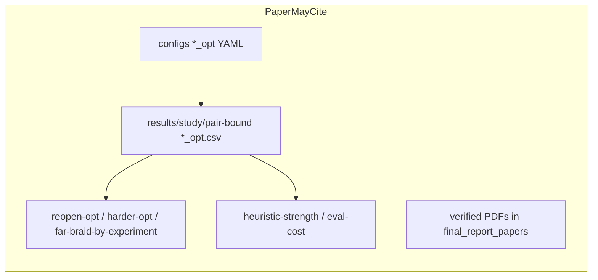

# Final Report Construction Plan

This is a planning/audit pass only. **Do not start Phase 0 or download papers until the user approves this revision and the minimum literature list.** After that, keep a project copy at [`.cursor/plans/final-report-construction.plan.md`](.cursor/plans/final-report-construction.plan.md). Do not modify [`docs/final_report/AuthorKit27`](docs/final_report/AuthorKit27).

---

## Writing rule: legacy F2E is invisible

The final report presents **one** SFBDS-F2E: the official pair lower bound plus the official better-g CLOSED reopen policy, as used in the `*_opt` experiments.

**Forbidden in every compiled report file** (Abstract, Introduction, Background, Problem Definition, Methodology, Algorithms, Results, Discussion, Limitations, Conclusions, Appendix, captions, footnotes):

- mentioning legacy gap-F2E, “two F2E eras,” or that a different F2E was implemented first
- legacy formulas, class names (`LegacyFixedEndpointGapHeuristic` or any gap-heuristic name), numbers, figures, or experiment history
- NoReopen pair-bound CSVs / snapshots as results, or a bug-fix narrative about 12 cost mismatches

**Allowed internally only** (never compiled): [`docs/final_report/final_version/notes/source_map.md`](docs/final_report/final_version/notes/source_map.md) may list excluded paths with the label **EXCLUDED FROM FINAL REPORT — never use as evidence.**

In the paper, official F2E is simply the implemented algorithm. Reopen is described as part of that algorithm (the remaining-cost adapter is not consistent on the pair key `(u,v)`), not as a later repair. Cost agreement with A* is a **validity result**, not a history of a prior failure.

---

## 1. Exact submission requirements

**Authoritative course source:** [`docs/context/Project_Instructions_context.md`](docs/context/Project_Instructions_context.md) (translation of the 2-page Hebrew `instructions.pdf`; the PDF itself is **not** in the repo).

The course requires a **practical research laboratory report**, submitted **in pairs**, that:

- states a search research question, describes implementation/experiments, analyzes results, and draws conclusions (§1.1, §2);
- includes a **link to the code used for experiments and graphs** (§7, §12.6);
- is academically written, clearly structured, and consistently cited (§8.3).

**Four central parts** (§2), with grading emphases:

1. **Introduction and literature review** (§3)
2. **Methodology** (§4)
3. **Experimental results** (§5)
4. **Experimental conclusions and summary** (§6) — shorter than the other parts

Structure is **flexible** (§1.4) if those four functions remain clear.

**Format:** recommended **AAAI’27 camera-ready style** (§8.1). Use `\nocopyright` (§8.2, §12.6). No course page limit, keywords, or reproducibility checklist. An abstract is required by the AAAI template. Keywords are not in the 2027 kit.

**Course research question** (§6.5 interpretation):

> Under which grid and heuristic conditions does Front-to-Front provide enough search reduction to justify its additional computational cost compared with Front-to-End?

**How we answer it:** pair expansions are primary; runtime / eval-cost are secondary. On Manhattan grids the extra F2F cost largely did not appear. That answers §6.5 for this setting; it does not claim “F2F is faster in general.”

**Secondary metrics:** `generated` and `peak_open` exist in official `paired.csv` but are not in generated analysis tables. Extract a compact table in Phase 5. Do not run new experiments.

---

## 2. Exact AAAI template decision

**Kit:** [`docs/final_report/AuthorKit27`](docs/final_report/AuthorKit27). Do not copy from the duplicate `docs/AuthorKit27`.

**Basis:** [`CameraReady2027.tex`](docs/final_report/AuthorKit27/CameraReady2027.tex) preamble/skeleton, not Anonymous.

- `\usepackage{aaai2027}` **without** `[submission]` (that option hides authors)
- Add `\nocopyright` after loading the style (course overrides AAAI’s publication ban on that command)
- Skip ReproducibilityChecklist, Word/, example figures, example `aaai2027.bib`

**Build:** PDFLaTeX only; natbib + `aaai2027.bst` (no `\bibliographystyle` in the document); `pdflatex` → `bibtex` → `pdflatex` × 2. No `hyperref`. Code link in the AAAI `links` environment between abstract and body. Figures via matplotlib PDF/PNG (`pgfplots` forbidden). Optional `booktabs` and `algorithm`/`algorithmic`. `\setcounter{secnumdepth}{2}`.

**Draft with `\input{sections/...}`** for gated review; flatten later only if desired. No page-count lock.

**Copy in Phase 0:** `aaai2027.sty`, `aaai2027.bst`, rewritten `main.tex`. Do not copy instruction PDFs or Anonymous files.

---

## 3. Final proposed report outline

**Title (working, Title Case):** *Comparing Front-to-Front and Front-to-End Heuristics inside Single-Frontier Bidirectional Search on Grids*

**Authors:** placeholders until names/emails/affiliation are supplied.

### Abstract (write last)

F2F vs **official SFBDS-F2E** (pair lower bound + reopen) inside one SFBDS; pair expansions primary; maze 22/30 and 26/30; median saving ~3.8%; open/corridor ties; costs agree with A* on tested instances (empirical, not a proof). No legacy, no “two eras,” no “F2F is faster.”

### 1. Introduction (write late)

Motivation, RQ, contribution, paper map. Compared objects: F2F Manhattan pair heuristic vs official F2E pair bound, same SFBDS except the bound and the F2E reopen policy. Not claimed: new BiHS paradigm; implemented pair-cache; general optimality theorem.

### 2. Background and Related Work

A*, BiHS, F2E vs F2F, SFBDS, pair lower bounds, Siag et al. expansions-vs-cost. Analyze, do not list. Cite **verified primary papers only** (Phase L). Lecture Markdown is not a citation. Do not mention any project-internal F2E history.

### 3. Problem Definition

4-connected unit grids; shortest path; paired F2F vs official F2E inside SFBDS; A* as cost/success sidecar. RQ: *On which grid families does F2F expand fewer pairs than SFBDS-F2E, and does that reduction justify extra heuristic cost on this cheap-\(h\) domain?*

### 4. Algorithms and Heuristics

Present the **current official implementation only**:

- F2F: \(h(u,v)=\mathrm{MD}(u,v)\) — [`src/sfbds_compare/heuristics/f2f.py`](src/sfbds_compare/heuristics/f2f.py)
- F2E LB: \(u=v \Rightarrow g_F+g_B\); else \(\max(g_F+\mathrm{MD}(u,G), g_B+\mathrm{MD}(S,v), g_F+g_B+1)\); OPEN uses \(h_{\mathrm{gap}}=\max(0,\mathrm{lb}-g_F-g_B)\) — [`src/sfbds_compare/heuristics/f2e.py`](src/sfbds_compare/heuristics/f2e.py)
- Official F2E search: `official_f2e_searcher()` = that bound + `f2e_policies()` (`BetterGReopenPolicy`) — [`src/sfbds_compare/search/sfbds.py`](src/sfbds_compare/search/sfbds.py)
- F2F: `default_policies()` / `NoReopenPolicy` (state this as the F2F policy set, not as “F2E used to be NoReopen”)
- Shared: Late goal-on-select, ordered-pair duplicates, TBh, branching-factor direction
- A*: Late, NoReopen, Manhattan; **state** expansions, not pairs

Do not name or formula-define any other F2E. Attribute the pair-bound formula to the verified NBS/Siag sources only after Phase L.

### 5. Experimental Setup

Official `*_opt` matrix only. Generators, seeds, pairing, Wilcoxon/sign/Holm, cost-mismatch exclusion (as a **protocol**, without a mismatch-history story), hardware, citable snapshots listed below.

### 6–9. Results, Discussion, Limitations, Conclusions

As before: geography then factors then secondary cost; Siag trade-off on **this** cheap-\(h\) domain; limitations without historical F2E; future work may mention pair-cache / Late-stop proof / expensive \(h\) without implying those were attempted.

### Appendix

Extra nested rows, eval-cost, heuristic-strength details, secondary metrics. Still no legacy.

---

## 4. Source map

### PRIMARY (paper evidence)

- Course contract: [`docs/context/Project_Instructions_context.md`](docs/context/Project_Instructions_context.md)
- Locked science: [`docs/research_log.md`](docs/research_log.md), [`results/analysis/pair-bound/research_log.md`](results/analysis/pair-bound/research_log.md), [`results/analysis/README.md`](results/analysis/README.md) — **use numbers from official snapshots; do not copy historical-era sentences into the paper**
- Implementation: `official_f2e_searcher`, `F2EPairLowerBound`, `F2FManhattanHeuristic`, policies, A*, generators, metrics
- Official configs: `configs/study/study_*_opt.yaml`; live `configs/followup/study_*_opt.yaml`
- Official CSVs: `results/study/pair-bound/*_opt.csv` only
- Citable snapshots:
  - [`2026-08-17-reopen-opt`](results/analysis/pair-bound/2026-08-17-reopen-opt/)
  - [`2026-08-17-harder-opt`](results/analysis/pair-bound/2026-08-17-harder-opt/)
  - [`2026-08-17-far-braid-by-experiment`](results/analysis/pair-bound/2026-08-17-far-braid-by-experiment/)
- Secondary: [`2026-08-17-heuristic-strength`](results/analysis/pair-bound/2026-08-17-heuristic-strength/), [`2026-08-17-eval-cost-sensitivity`](results/analysis/pair-bound/2026-08-17-eval-cost-sensitivity/)
- Verified papers: [`docs/context/final_report_papers/`](docs/context/final_report_papers/) after Phase L

### SECONDARY (supporting, not citation authority)

- Literature **Markdown notes** under [`docs/context/sfbds_literature_context_md/`](docs/context/sfbds_literature_context_md/) — **navigation only**
- Lecture summaries under [`docs/context/presentations_summary/`](docs/context/presentations_summary/) — methodology language only; not bibliography
- [`docs/project_definition.md`](docs/project_definition.md) — topic map; Idea B cache was **not** implemented
- Analysis PNGs — regenerate for the paper
- `generated` / `peak_open` in `paired.csv`

### EXCLUDED FROM FINAL REPORT — never use as evidence

Record these only in `final_version/notes/source_map.md`:

- `results/study/legacy/`, `results/analysis/legacy/`, `results/pilot/legacy/`
- `LegacyFixedEndpointGapHeuristic` and all gap-F2E numbers/figures
- Pair-bound CSVs **without** `_opt` (NoReopen)
- Snapshots: `2026-08-17-baseline-study`, `cost-clean-tests`, `cost-clean-plots`
- `2026-08-17-far-braid-opt` pooled README (use `far-braid-by-experiment`)
- Non-`_opt` follow-up YAMLs / `configs/followup/retired/`
- Pooled nested-random / pooled maze-across-experiments / all-query Spearman / “F2F is faster” as a general claim



---

## 5. Claim–evidence matrix

- **F2F expands fewer pairs on perfect mazes** — reopen-opt maze 127 **22/30**, Holm p≈4.77e-07, median saving **3.8%**; harder-opt maze 255 **26/30**, Holm p≈2.98e-08, median saving **3.8%**. High.

- **Open and corridor are essentially all ties** — reopen-opt open 128 and corridor 512: **0/30** untied. High at these sizes. Do not say “F2F never helps.”

- **Nested random is weaker, density- and seed-dependent** — reopen-opt 64@30% seed 110: **13/30**; harder-opt seed 210: 64@40% **16/30**, 64@45% **14/1/15**, 128@45% **11/30**. Do not pool seeds. Nested 30% vs 45% are not paired maps. Medium.

- **Braiding reduces the F2F advantage** — far-braid-by-experiment: 127 braid **12/30** vs 22/30; 255 braid **11/30** vs 26/30. High for these generators.

- **Longer Manhattan at fixed maze 127 did not strengthen the effect** — far-opt **15/30** vs 22/30. High for this generator/seed.

- **On official `*_opt` instances, F2F, F2E, and A* agree on solution cost** — 0 mismatches in the three citable snapshots. Empirical coverage only; not a general optimality theorem. Do not narrate a prior mismatch set.

- **Official F2E uses better-g CLOSED reopen** — implementation fact (`f2e_policies()`). Paper motivation: remaining-cost \(h_{\mathrm{gap}}\) is not consistent on `(u,v)`. Do not present this as a post-hoc bug fix.

- **Heuristic-strength partially explains expansions** — heuristic-strength README; F2E never strictly stronger on recorded `evaluate()` pairs; nested 45% q=8 counterexample. Untied-only Spearman. Mechanism only.

- **F2F is faster** — **not a main claim.** Timed maze 127 only: 22/22 untied, median ratio **0.885**. Eval-cost: no crossover, secondary.

- **§6.5 cost justification on this domain** — F2F never had more `heuristic_evals` on the three eval-cost families; timed maze slightly favored F2F. Does not refute Siag et al. on expensive two-frontier F2F.

- **Generated / peak_open** — extract in Phase 5. Do not invent numbers.

- **Cache shifts the runtime crossover** — not done. Future work only.

---

## 6. Figure and table plan

Unchanged in substance: regenerate paper figures from official `*_opt` `paired.csv` and secondary official snapshots. Do not generate from excluded paths.

Main minimum: instance matrix; headline expansions; maze scatter; maze-factor table; heuristic-strength share figure.

Optional/appendix: eval-cost curve; generated/peak_open table; nested-density rows with \(n_{\mathrm{untied}}\ge 10\) faceted by experiment.

---

## 7. Literature plan and proposed minimum paper set

Markdown notes under [`docs/context/sfbds_literature_context_md/`](docs/context/sfbds_literature_context_md/) and lecture summaries **identify** papers. They are **not** citation authority. Every cite in the report must be traced in [`docs/context/final_report_papers/PAPER_SOURCE_MAP.md`](docs/context/final_report_papers/PAPER_SOURCE_MAP.md) after Phase L.

**Do not download until this list is approved.**

### Cite (minimum)

**1. Hart, Nilsson, and Raphael (1968) — A\***
- Why: unidirectional baseline, admissibility, \(f=g+h\).
- Identified by: lecture [`02_SAI-3-4_Best-First-AStar_context.md`](docs/context/presentations_summary/02_SAI-3-4_Best-First-AStar_context.md) (not in the 10-note pack).
- Sections: Background; Algorithms (A* sidecar).
- Need: **bibliographic verification**; full PDF only if we cite a specific theorem beyond the standard definition.

**2. Moldenhauer, Felner, Sturtevant, and Schaeffer (2010) — SFBDS**
- Why: pair-frontier algorithm we implement; natural F2F; direction choice; expansions-vs-runtime warning.
- Identified by: [`01_single_frontier_bidirectional_search_2010.md`](docs/context/sfbds_literature_context_md/01_single_frontier_bidirectional_search_2010.md). Note URL: https://ojs.aaai.org/index.php/AAAI/article/view/7555
- Sections: Background; Algorithms.
- Need: **full PDF** (pair-node definition, direction policy, F2F evaluation).

**3. Barker and Korf (2015) — Limitations of F2E BiHS**
- Why: why F2E often fails to add bidirectional + heuristic savings; F2E definition \(h_F,h_B\).
- Identified by: [`03_limitations_front_to_end_2015.md`](docs/context/sfbds_literature_context_md/03_limitations_front_to_end_2015.md). Note URL: https://ojs.aaai.org/index.php/AAAI/article/download/9374/9233
- Sections: Background.
- Need: **full PDF** for the overlapping-savings claim (do not copy numbers from the note).

**4. Chen, Holte, Zilles, and Sturtevant (2017) — NBS**
- Why: pair lower bound \(\max(f_F,f_B,g_F+g_B)\) that our unit-grid F2E instantiates (with \(+1\) when \(u\neq v\)).
- Identified by: [`05_near_optimal_bidirectional_search_nbs_2017.md`](docs/context/sfbds_literature_context_md/05_near_optimal_bidirectional_search_nbs_2017.md). Note URL: https://www.ijcai.org/proceedings/2017/0069.pdf
- Sections: Background; Algorithms (attribute the bound after PDF check).
- Need: **full PDF** before writing “NBS-style” or the \(+1\) meeting term.

**5. Siag, Shperberg, Felner, and Sturtevant (2023, SoCS) — Comparing F2F and F2E**
- Why: most direct prior work; F2F more informed; pairwise cost; SFBDS as one-eval-per-pair; expansions ≠ runtime.
- Identified by: [`06_comparing_f2f_and_f2e_2023.md`](docs/context/sfbds_literature_context_md/06_comparing_f2f_and_f2e_2023.md). Note URL: https://ojs.aaai.org/index.php/SOCS/article/view/27296
- Sections: Introduction; Background; Discussion.
- Need: **full PDF** (including the SFBDS remark). Do not copy experimental numbers from the note onto our grids.

**6. Siag, Shperberg, Felner, and Sturtevant (2023, IJCAI) — Enumerating F2E algorithms and bounds**
- Why: unspecified F2E formula confounds heuristic comparisons; pair-bound family. Justifies fixing one SFBDS-F2E bound rather than a two-frontier bake-off.
- Identified by: [`07_enumerating_algorithms_and_bounds_2023.md`](docs/context/sfbds_literature_context_md/07_enumerating_algorithms_and_bounds_2023.md). Note URL: https://www.ijcai.org/proceedings/2023/0625.pdf
- Sections: Background; Algorithms.
- Need: **full PDF** for the pair-bound expressions we analogize.

**Locked 2026-08-18:** collect **only papers 1–6**. Do not collect Lippi 2012. If Conclusions mention pair-cache as future work, cite Moldenhauer 2010’s pairwise-caching remark after that PDF is verified — not a separate eSBS paper.

### Do not collect (not needed for this report)

- Lippi et al. 2012 (`02`) — skipped; cache future-work (if any) uses Moldenhauer 2010
- Barker 2015 dissertation (`04`) — redundant with Barker and Korf 2015
- Siag and Shperberg 2025 AIJ (`08`) — two-frontier theory–practice gap; we do not compare against SOTA F2E BiHS
- Shubi et al. 2026 (`09`) — longest paths / MAX
- Zou et al. 2026 F2A (`10`) — two-frontier attractors, not SFBDS
- Pohl 1969 (lecture Master-Class) — optional classic BiHS origin; skip unless Background feels too thin without it

Lecture slides are not bibliography entries.

### Collection layout (Phase L, after list approval)

```text
docs/context/final_report_papers/
  papers/
    <key>.pdf
  PAPER_SOURCE_MAP.md
```

Each map row: canonical title, authors, year, venue, DOI/URL, local filename, report section, exact claim/formula, verified yes/no, planned BibTeX key.

If paywalled: bibliographic verification from the publisher page; missing PDF is a blocker **only** if we need a formula/claim we cannot otherwise verify. Do not invent contents.

---

## 8. Step-by-step execution (stop after each phase)

**Do not auto-start the next phase.**

**Phase L — Literature collection** (separate gate; **not** started until the paper list above is approved)
- Create `docs/context/final_report_papers/`, download only approved PDFs from publisher/proceedings URLs, write `PAPER_SOURCE_MAP.md`, verify title/authors/venue/year and the specific claims we will cite.
- Can overlap Phases 0–2. **Must finish before Phase 3.** Phase 2 may state formulas from **code**; it may not attribute them to NBS/Siag until Phase L verification.

**Phase 0 — Lock template + source map**
- Copy sty/bst; dummy `main.tex` with `\nocopyright`; `notes/source_map.md` using **EXCLUDED FROM FINAL REPORT — never use as evidence** for banned paths; empty `references.bib`; build README.
- No report prose.

**Phase 1 — Skeleton only**

**Phase 2 — Problem + algorithms** from official code. No historical F2E. No gap formula. No class name of excluded heuristics.

**Phase 3 — Background** from verified `PAPER_SOURCE_MAP.md` only.

**Phase 4 — Experimental methodology** (`*_opt` only). Cost-mismatch exclusion as protocol, not as a story.

**Phase 5 — Freeze figures** from official `paired.csv` / secondary official CSVs.

**Phases 6–13** — Results through abstract; bib audit against Phase L keys; QA that **no compiled file mentions legacy/gap/two eras**; course checklist; code link.

---

## 9. Proposed `final_version` layout

Unchanged, except `notes/source_map.md` is the only place excluded-era paths may be named. Paper PDFs live under `docs/context/final_report_papers/`, **not** under `final_version/`.

---

## 10. Missing information / blockers

- Author names, emails, BGU affiliation
- Public code URL
- **Approval of the minimum paper list before any download**
- Hardware/OS/Python for methodology
- Original `instructions.pdf` not in repo
- Generated/peak_open not yet tabulated
- Page length unlocked

---

## 11. Risks

- Any compiled mention of legacy/gap/two F2E eras (highest)
- Citing Markdown notes as if they were papers
- Attributing the F2E bound to NBS before the Chen/Siag PDFs are checked
- Citing `far-braid-opt` pooled README
- Pooling nested seeds
- Promoting runtime or eval-cost
- Claiming general optimality
- Over-reading heuristic-strength Spearman
- `hyperref` / `pgfplots`; wrong AuthorKit tree; Anonymous `[submission]`

---

## 12. First steps after this revision is approved

1. **Do not start Phase 0 until you also approve Phase 0.**
2. **Approve or trim the minimum paper list** (section 7). Then Phase L may collect PDFs.
3. After that, Phase 0 can proceed in parallel with remaining Phase L work.

Then stop for review after each phase.
