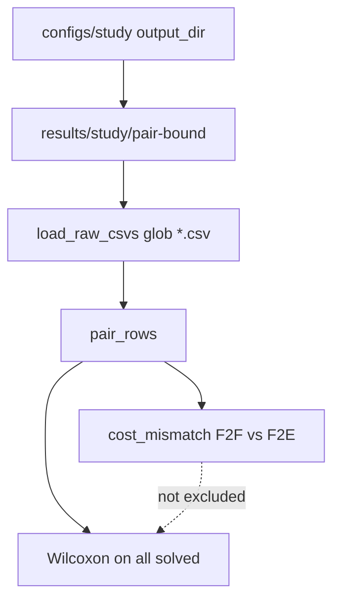

# Judge: pair-bound F2E study split (`ea34645`..working tree)

Review of the current Git diff and surrounding code. **No files were modified.** Tests were treated as evidence, not proof.

## Intended behavior

- Official `sfbds_f2e` is [`F2EPairLowerBound`](src/sfbds_compare/heuristics/f2e.py): `lb = gsum` at meeting, else `max(f_F, f_B, gsum+1)`, stored as `h_gap = max(0, lb − gsum)`.
- Frozen gap-F2E artifacts live under `legacy/`; new runs under `pair-bound/`. Analysis `--input-dir` is one formula folder, **non-recursive**.
- Same 64/128 study question as 2026-08-14, with the pair bound. Maze should stay the expansion claim if costs match A*.

## Architecture / invariants

- [`SFBDSSearcher`](src/sfbds_compare/search/sfbds.py) Late goal, TBh, **no reopen** on CLOSED pairs.
- Pairing in [`pair.py`](src/sfbds_compare/analysis/pair.py): Wilcoxon/sign on **all solved** pairs; `cost_mismatch` is F2F cost ≠ F2E cost only.
- Generated analysis README is the public table; [`docs/research_log.md`](docs/research_log.md) already warns not to treat the 12 mismatches as a fair expansion comparison.

---

## Findings (severity order)

### 1. High — Nested-random Wilcoxon includes suboptimal F2E paths; dropping them nulls the p-value

**Where:** [`src/sfbds_compare/analysis/summarize.py`](src/sfbds_compare/analysis/summarize.py) ~75–78 (`solved` includes mismatches); [`pair.py`](src/sfbds_compare/analysis/pair.py) 106–114; published table in [`results/analysis/pair-bound/2026-08-17-baseline-study/README.md`](results/analysis/pair-bound/2026-08-17-baseline-study/README.md) nested-density row `study_random_64` / 1228 obstacles (13 F2F-fewer, Holm p ≈ 0.0002).

**Why:** All 12 `cost_mismatch` rows are nested-random, F2E cost **above** A* and F2F (typically +2), and all 12 have **large positive** `expansion_diff` (F2F fewer). The 64×64 @ 30% slice has **exactly 13** untied pairs; **4 of those 13** are mismatches (queries 6, 9, 20, 22). The other 9 are cost-clean.

**Failure scenario:** Cite “nested 64 @ 30% still unties, Holm p ≈ 0.0002” as a pair-bound confirmation. After excluding the 4 invalid expansion diffs, `n_untied = 9`, which this project’s own rule (`n_untied < 10` → p null) would **not** report. The headline F2F-fewer count is also inflated by F2E searching a longer, non-optimal path (e.g. q=20 @ 1228: F2F 450 pairs / cost 53 vs F2E 2881 / cost 57).

**Correction:** Exclude `cost_mismatch` (and F2E ≠ A*) from expansion tests, or report a cost-clean sensitivity table. Do not cite the current 64@30% p-value. Maze 127 (22/30, 0 mismatches) is the claim that survives.

This is also an **optimality** hole in official F2E on random maps (inconsistent remaining-cost adapter + `NoReopenPolicy`). Cost-agreement tests only cover tiny open/maze grids ([`tests/integration/test_cost_agreement.py`](tests/integration/test_cost_agreement.py)).

### 2. Medium — `cost_mismatch` ignores A*, and tests still treat mismatched rows as solved

**Where:** [`pair.py`](src/sfbds_compare/analysis/pair.py) 106–114; [`summarize.py`](src/sfbds_compare/analysis/summarize.py) 75; no unit test that mismatches leave `expansion_diff` out of Wilcoxon.

**Why:** Flag is F2F vs F2E only. A future run where both SFBDS algorithms match each other but beat/lose to A* would look “clean.” Detour still uses A* cost, so buckets mix incomparable expansion work.

**Failure scenario:** F2F and F2E both return cost 55, A* returns 53 → `cost_mismatch=False`, Wilcoxon keeps the row.

**Correction:** Flag `f2f_cost != astar` or `f2e_cost != astar` when A* succeeded; drop those rows from expansion tests; add a test that 12 synthetic mismatches do not enter `n_untied`.

### 3. Medium — Generated README always claims pooled random mixes independent files

**Where:** [`src/sfbds_compare/analysis/report.py`](src/sfbds_compare/analysis/report.py) line 341 (unconditional sentence).

**Why:** This run’s `map_family=random` tests are skipped because nested collapse makes `n_test != n_solved` ([`summarize.py`](src/sfbds_compare/analysis/summarize.py) 57–65), **not** because independent `*_d10` CSVs were loaded. The sentence is leftover from the legacy ingest bug.

**Failure scenario:** A reader of [`2026-08-17-baseline-study/README.md`](results/analysis/pair-bound/2026-08-17-baseline-study/README.md) line 62 thinks independent CSVs leaked into pair-bound analysis. They did not (only `configs/study/` stems).

**Correction:** Emit that sentence only when `_skip_pooled_random_tests` is due to a nested/independent mix; otherwise say tests are skipped because nested densities were collapsed.

### 4. Low — No test that `load_raw_csvs` stays non-recursive

**Where:** [`src/sfbds_compare/analysis/load.py`](src/sfbds_compare/analysis/load.py) 113 (`root.glob("*.csv")`); [`test_cli_hints_when_input_dir_has_formula_subdirs`](tests/unit/test_analysis.py) 509 only covers **empty** parent dirs.

**Why:** A later “fix” back to `rglob` would mix `results/study/legacy` + `pair-bound` if someone passed `results/study`. The hint test would still pass.

**Correction:** Put a raw CSV in `tmp_path/legacy/` and assert `load_raw_csvs(tmp_path)` does not ingest it.

### 5. Low — Old-stem pilot YAMLs now write into `pair-bound/`

**Where:** [`configs/pilot/pilot_corridor.yaml`](configs/pilot/pilot_corridor.yaml) (and open/maze/random) `output_dir: results/pilot/pair-bound`.

**Why:** Runner always uses current official F2E. Re-running `pilot_corridor` would create `results/pilot/pair-bound/pilot_corridor.csv` with the **new** formula under the **legacy stem**.

**Correction:** Point non-`*_lb_f2e` pilot YAMLs at `results/pilot/legacy/` or rename/retire them.

---

## Not findings (checked)

- Spy test now locks first child `(g_F, g_B) == (1.0, 0.0)` on the 1×4 corridor ([`test_sfbds.py`](tests/unit/test_sfbds.py) 210–225). Swapped kwargs fail.
- Formula + adapter match the locked plan; SFBDS passes `g` at root and child insert.
- `--input-dir` non-recursive; empty parent with `legacy/` + `pair-bound/` prints a hint.
- `results/analysis/pair-bound/README.md` contains `index of snapshots`, so dumping `--out-dir` there is refused.
- Maze / open / corridor costs agree with A* in this snapshot. Maze 22/30 F2F-fewer is cost-clean.
- YAML `output_dir` for study + follow-up is `results/study/pair-bound`; config tests lock that.

## Requirements apparently satisfied

- Official F2E is the pair lower bound; legacy gap renamed and retargeted.
- Formula trees split; analysis load will not recurse into the sibling folder.
- Pair-bound baseline snapshot exists; 810/810 success, 0 timeouts, 270 pairs.
- Research logs tell the reader not to cite legacy READMEs as corrected F2E, and that the 12 mismatches are the next question.

## Requirements not demonstrated

- Pair-bound F2E is **solution-optimal** vs A* on nested random maps (12 counterexamples).
- Nested-random expansion tests under a cost-clean subset (`n_untied` would be 9 at 64@30%).
- Follow-up maze 255 / braid / denser random under the pair bound (YAMLs point at `pair-bound/` but were not rerun).
- A regression test that replays one of the 12 maps (e.g. `study_random_64` q=20, 1228 obstacles).

## Tests to add (when implementing, not now)

- Exclude `cost_mismatch` / A* disagreement from Wilcoxon; assert 64@30% cost-clean `n_untied`.
- Replay one mismatch map: F2E cost must equal A* (will fail until the search/bound issue is fixed).
- `load_raw_csvs` does not read `input_dir/subdir/*.csv`.
- README omit “independent files” unless those files are actually in the run.

Do not execute this plan unless the user asks to fix the findings. The maze expansion claim can stay; the nested-random p-value must not.
