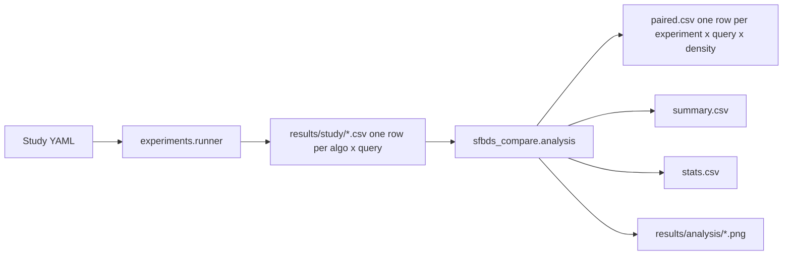

# Paired analysis and nested-density sampling

Raw CSV/JSON stays as it is: one row per `algorithm × query`, same `map_hash` / endpoints / metrics. Search, heuristics, and `RunRecord` **fields** are not redesigned (no new raw columns). A* remains a baseline only (cost, runtime, success). The F2F vs F2E comparison uses pair expansions only.



## 1. Files to change

**Keep as-is (schema / search):**
- [`src/sfbds_compare/experiments/runner.py`](src/sfbds_compare/experiments/runner.py) `RunRecord` fields
- [`src/sfbds_compare/experiments/export.py`](src/sfbds_compare/experiments/export.py)
- [`src/sfbds_compare/search/sfbds.py`](src/sfbds_compare/search/sfbds.py), A*, heuristics

**Generator / config (nested density):**
- [`src/sfbds_compare/experiments/generators.py`](src/sfbds_compare/experiments/generators.py) — shuffle-then-prefix instead of `rng.sample(k)`
- [`src/sfbds_compare/experiments/config.py`](src/sfbds_compare/experiments/config.py) — `obstacle_densities`; **mutually exclusive** with `obstacle_density`
- [`src/sfbds_compare/experiments/runner.py`](src/sfbds_compare/experiments/runner.py) — density as a factor on the **same** `query_index`; connect on densest only; **skip `write_visual` when `obstacle_densities` is set**
- Study YAMLs under [`configs/study/`](configs/study/) — one nested random config (`study_random_128.yaml`) instead of three independent density files
- [`tests/unit/test_experiment_config.py`](tests/unit/test_experiment_config.py) `_STUDY_SPECS` (exact filename set)
- New unit tests for nested prefixes and same endpoints across densities

**Do not delete** existing [`results/study/`](results/study/) artifacts. New name `study_random_128.yaml` writes new files. Analysis load should prefer grouping by `experiment` so old `*_d10/d20/d30` CSVs and the new nested file can coexist in the same folder.

## 2. New analysis module

Add `src/sfbds_compare/analysis/` (stdlib `csv` + `statistics`). Optional extra **`analysis = ["matplotlib", "scipy"]`** — not a core search dep. CLI: `python -m sfbds_compare.analysis --input-dir results/study --out-dir results/analysis` with **`--no-plots`**; if matplotlib is missing, skip plots with a warning. If scipy is missing, skip p-values with a warning (still write paired/summary descriptives).

| File | Role |
|---|---|
| `load.py` | Read one or many raw study CSVs (skip `*_visual.txt` and JSON) |
| `pair.py` | One row per **pair key** (below); A* sidecar only |
| `metrics.py` | Locked formulas |
| `stats.py` | Paired Wilcoxon, sign test, effect size, Holm |
| `summarize.py` | Groups below, plus test columns |
| `plots.py` | The six report plots |
| `__main__.py` | CLI |

### Identity (analysis-only)

`map_family`: `open` / `random` / `maze` / `corridor` from `generator_kind` (`random_obstacles` → `random`). `size = max(height, width)`.

**Family key** (same query across nested densities):

`family_id = "{experiment}:{generator_kind}:{height}x{width}:{seed}:{query_index}"`

**Pair key** (one `paired.csv` row; F2F vs F2E on **one** map):

`pair_id = "{family_id}:{map_hash}"`

Do **not** unique `paired.csv` on `family_id` alone. Nested 30 queries × 3 densities → **90** paired rows, not 30. Include `experiment` so two YAMLs with the same seed/size cannot collide. Pairing still requires both SFBDS rows with the same `map_hash` + `query_index` + endpoints.

### Locked formulas

Solved pair = both SFBDS `success` and neither `timed_out`.

- `manhattan_distance` from CSV start/goal (`|Δrow|+|Δcol|`).
- `detour_ratio`: A* `solution_cost / md` when A* succeeded and `md > 0`; else successful SFBDS cost / md; else null. If `md == 0`: `1.0` when that cost is 0, else null.
- `expansion_diff = f2e_expanded - f2f_expanded` (null unless solved pair).
- `expansion_ratio = f2f_expanded / f2e_expanded` if solved and `f2e_expanded > 0`, else null.
- `expansion_saving_pct = (f2e_expanded - f2f_expanded) / f2e_expanded * 100` under the same guard.
- `generation_saving_pct` analogous with `generated`.
- `runtime_ratio = f2f_runtime / f2e_runtime` if solved and `f2e_runtime > 0`, else null (same for `heuristic_time_ratio`).

Never mix A* `expanded` (states) into F2F/F2E saving %. If F2F and F2E both succeeded but `solution_cost` differs, keep the row and set `cost_mismatch=true` (should not happen).

**Timeouts:** keep the paired row; all ratio/saving/diff fields null. **Win %, tie %, mean, and median saving/ratio use solved pairs only.** Summary still reports timeout counts. Do not treat partial timeout `expanded` as a real count.

### Density grouping (no new raw column)

Exported `obstacle_density` is realized `count/(h*w)`, not YAML 0.10/0.20/0.30. Group random maps by **`obstacle_count`** (three distinct prefix lengths in a nested family). Optional label `round(obstacle_count / (height*width), 2)` for plots. Do not group on full-precision realized floats.

### Statistical significance (paired F2F vs F2E)

Tests run on **solved pairs only**. Do not test A* state expansions against SFBDS pairs. Do not treat timeout partial `expanded` as data.

**Independence (nested densities):** 10/20/30% of the **same** `query_index` share endpoints and nested obstacles. Do **not** stack those rows into one Wilcoxon as if n=90.

- Planned random-map tests: **one Wilcoxon per `obstacle_count`** (n ≤ 30 queries).
- Optional overall-random: **one row per `family_id`** (median `expansion_diff` across the three densities, or only the densest map), n ≤ 30. Never n = 90 stacked maps.
- Holm family for density = the three density tests only, not “overall + three.”
- Open / maze / corridor are independent queries (one map each); those map-family tests are n ≤ 30.

**Primary (pre-specified claim):** median pair expansions. Two-sided Wilcoxon signed-rank on `expansion_diff = f2e_expanded - f2f_expanded`. H0: median difference is 0. scipy `wilcoxon(..., zero_method="wilcox")` (drop exact zeros). `method="exact"` when `n_untied ≤ 25`, else `"auto"`. If `n_untied < 10`, write `p=null` and a reason (expected on open/corridor when F2F and F2E often tie). Do not treat a null p as a missing result.

**Confirmatory (not co-primary):** two-sided exact sign / binomial test on `{F2F fewer, F2E fewer}` **excluding ties**. H0: P(F2F fewer | untied) = 0.5. Ties are a separate percentage, not evidence against H0. Wilcoxon answers median magnitude; the sign test answers win rate. Report both; **do not pick whichever p is smaller** if they disagree.

**Secondary (same solved pairs, same guards):** Wilcoxon on `generated` and on `runtime_sec`. Runtime is noisy; report it but do not let it drive the F2F-vs-F2E claim.

**Effect size (always, even when p is null):**
- median `expansion_diff` and median `expansion_saving_pct`
- matched-pairs rank-biserial from the untied diffs, **not** from scipy’s `statistic` (W’s meaning varies by scipy version):

`T+` = sum of ranks of positive `expansion_diff` (F2E more expansions); `T-` = sum of ranks of negative diffs; `n = n_untied`;

`r_rb = (T+ - T-) / (n*(n+1)/2)` with the sign convention **positive ⇒ F2F fewer expansions**. If `n == 0`, `r_rb` is null.

**Where tests are computed:** each **planned** grouping (map family; size if used; random `obstacle_count`; optional overall-random via `family_id` as above). Detour-bucket tests are exploratory: raw p only, **not** Holm-adjusted, labeled `exploratory=true`. Same `n_untied < 10 → p=null` skip applies to exploratory buckets.

**Multiple comparisons:** Holm-adjust Wilcoxon p-values **within** each planned family (four map-family tests together; three density tests together). Holm-adjust **sign-test** p-values in their **own** family (do not mix Wilcoxon and sign into one Holm pile). Do not Holm-adjust across unrelated families. Report both `p_raw` and `p_holm`. Exploratory detour p-values stay raw only.

**Output:** `results/analysis/stats.csv` (and the same columns merged onto `summary.csv`). Columns at least: `group_type`, `group`, `n_solved`, `n_untied`, `n_f2f_fewer`, `n_f2e_fewer`, `n_tie`, `median_expansion_diff`, `median_expansion_saving_pct`, `wilcoxon_stat`, `wilcoxon_p_raw`, `wilcoxon_p_holm`, `rank_biserial`, `sign_p_raw`, `sign_p_holm`, `note`.

No new plots required for stats; the scatter + y=x already shows the paired relationship.

### Summary and plots

Groups: map family, size, obstacle_count (random only), optional detour buckets `[1, 1.1)`, `[1.1, 1.5)`, `[1.5, 2)`, `[2, inf)`. Per group: n_solved, n_timeout, % F2F fewer / F2E fewer / tie **among solved**, mean and median saving % (expansions and generations), runtime and heuristic-time ratio mean/median, plus the stats columns above for planned groups.

Plots under `results/analysis/` (do not commit PNGs):

1. F2E vs F2F expansions scatter + y=x (**solved pairs only**)
2. Expansion saving % by map family
3. Expansion saving % by obstacle_count (random)
4. Expansion saving % vs detour_ratio
5. Runtime ratio (F2F/F2E)
6. Optional: meeting `g_F` vs `g_B`; forward vs backward expansions

After implementation, run analysis **on the existing study CSVs** as a smoke check (expect 30 paired rows per independent random file; no cross-density pairing until nested YAML). Filter or group by `experiment` so old and new files in one folder stay distinct.

## 3. Nested-density generation — locked order

Today [`_sample_obstacles`](src/sfbds_compare/experiments/generators.py) uses `rng.sample`. Same seed with different `k` is **not** nested. Python `sample(k)` is **not** `shuffle` then `[:k]`. Same-seed **reproducibility** still holds after the switch; exact obstacle sets vs today’s generator will change. Old CSVs will not bit-match a re-run. Do not overwrite them. Update tests that assume `sample()` sets; keep same-seed equality tests.

**Config:** `obstacle_density` (scalar, pilots) XOR `obstacle_densities` (list). Reject both. Densities must be in `[0, 1)`, unique; use them sorted; densest = `max`.

**Locked generation order** (do not re-shuffle after relocation; do not call `ensure_connected_query` per density):

1. Sample start/goal once (`query_sample`, existing seed).
2. Shuffle **non-reserved** cells once (`seed + query_index`). Reserved = **original** sampled S/G.
3. Density `d` takes prefix length `round(d * n_candidates)`. Then `obstacles_10 ⊆ obstacles_20 ⊆ obstacles_30`.
4. Build the **densest** map; run `ensure_connected_query` **once** with the existing RNG `seed + query_index + 1_000_003` (keeps obstacles, may move S/G onto the densest free component, still `min_manhattan`). Relocated S/G are not in the 30% prefix ⇒ not in shorter prefixes.
5. Lower densities: **same prefixes + relocated endpoints**. Original reserved cells stay free (never in the shuffle) even if unused.

Path at 30% ⇒ path at 10/20%. Same `(start, goal)` across the three densities. F2F and F2E still share one `problem` / `map_hash` **within** a density.

**Visuals:** `main()` must **not** write `*_visual.txt` when `obstacle_densities` is set (128² × queries × densities × algos is too large). Single-density pilots keep visuals.

```yaml
name: study_random_128
seed: 110
generator:
  kind: random_obstacles
  height: 128
  width: 128
  obstacle_densities: [0.10, 0.20, 0.30]
query_sample: { count: 30, min_manhattan: 48 }
```

Runner: for each query, connect on densest, then for each density, for each algorithm. `query_index` stays 0..29 (not 0..89).

Single-density `obstacle_density: 0.15` (pilots) stays supported via shuffle+prefix with that `k`.

## 4. Proposed experimental matrix (next study, not run now)

- `algorithm`: astar, sfbds_f2f, sfbds_f2e
- `map_family`: open, random, maze, corridor
- `size`: `max(h,w)` (maze 63/127; corridor 256/512 is a different size bucket)
- random density factor: nested 0.10 / 0.20 / 0.30, grouped by `obstacle_count`
- identity: `family_id` / `pair_id` as above

Queries: 30 per cell. Timeouts unchanged. No 256² grids.

This pass only **replaces** the three independent 128 random YAMLs with one nested file (update `_STUDY_SPECS`) and optionally adds a nested 64 later. Leave old result files in place.

## 5. Expected run counts (later, not this PR)

Per 128-class family, 30 queries × 3 algorithms: open 90, maze 90, corridor 90, random nested 270. **Do not treat wall-clock as “minutes”** until a 128 SFBDS sample is timed; 270 × 60s timeout is hours in the all-timeout worst case.

This step: unit tests + analysis CLI on **existing** CSVs only. No full matrix re-run until you ask.

## Tests

- Shuffle-prefix: `obs10 ⊆ obs20 ⊆ obs30` for the same seed and original reserved cells
- Nested runner: same start/goal at all three densities; connected at 30% ⇒ connected at 10%; F2F/F2E share `map_hash` within a density; `ensure_connected` is not re-run at 10/20%
- Pairing: 9 raw rows (3 queries × 3 algos) → 3 paired rows; 3 queries × 3 densities × 3 algos → **9** paired rows
- `family_id` shared across densities; `pair_id` unique per density (`map_hash`)
- Detour uses A* cost when A* succeeded; `md == 0` as locked
- Zero `f2e_expanded` → null ratios, no crash
- Timeout fixture: partial `expanded` does not change win% or mean saving
- Summary n_solved / n_timeout / win / tie on a tiny fixture
- Stats: fixture where F2F expansions are strictly smaller → Wilcoxon and sign p < 0.05; all-tie fixture → n_untied = 0, p null; timeout rows excluded; Holm of two dummy p-values matches the expected adjusted pair (Wilcoxon family and sign family separately)
- Nested-density stats: stacking 3 densities of the same `family_id` into one test is forbidden; per-`obstacle_count` tests have n = n_queries; optional overall-random uses one row per `family_id`
- Rank-biserial computed from T+/T- on a hand fixture (not from scipy `statistic`)
- `n_untied < 10` → p null, including an exploratory detour bucket
- `pytest.importorskip("scipy")` for stats tests; `--no-plots` analysis smoke still works without matplotlib/scipy (descriptives only)
- Pilots: scalar `obstacle_density: 0.15` still runs; same seed twice → same obstacles
- Config: reject both density keys; `_STUDY_SPECS` matches the study directory
- Analysis smoke on **current** independent CSVs: 30 paired rows per random file; CLI `--no-plots` works without matplotlib
