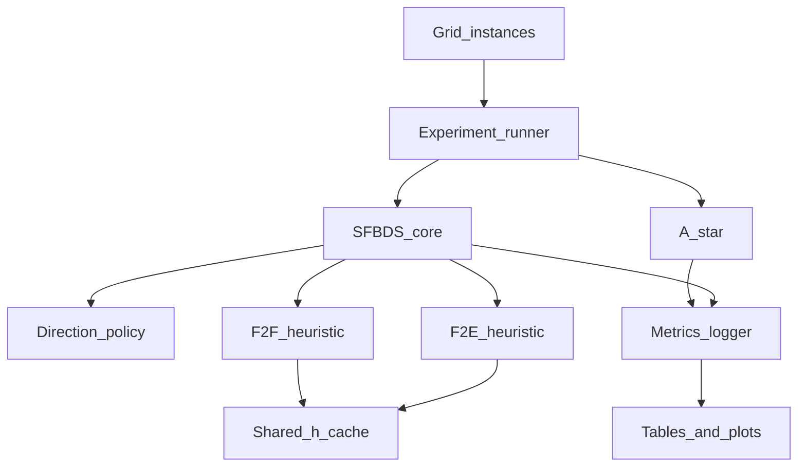

# SFBDS / F2F / F2E Research Project Definition

Sources: [`Project_Instructions_context.md`](docs/context/Project_Instructions_context.md), literature notes [`01`](docs/context/sfbds_literature_context_md/01_single_frontier_bidirectional_search_2010.md)–[`10`](docs/context/sfbds_literature_context_md/10_front_to_attractors_2026.md), lecture notes in [`presentations_summary/`](docs/context/presentations_summary/). Context notes are paraphrases; formal claims and tables must be verified in original papers before the final report ([`README.md`](docs/context/sfbds_literature_context_md/README.md)).

---

## Stage 1: Literature Mapping

### Paper-by-paper map

**1. Moldenhauer et al. 2010 — Single-Frontier Bidirectional Search** ([`01_...`](docs/context/sfbds_literature_context_md/01_single_frontier_bidirectional_search_2010.md))
- **Problem:** Traditional BiHS coordination (direction, node, termination, cross-direction heuristics) often fails to deliver ~d/2 depth reduction.
- **Method:** SFBDS — one OPEN of paired nodes \(N=(s_N,g_N)\); expand start-side → \((s',g)\) or goal-side → \((s,g')\); local direction decision.
- **Focus:** SFBDS, F2F natural \(h(s_N,g_N)\), direction selection; caching suggested for pairwise \(h\).
- **Domains / metrics:** Multiple benchmarks (*names must be verified in original*); expansions, generations, runtime, branching asymmetry, direction policy.
- **Empirical:** Does not always dominate A* or all Bi methods; helps when directions differ meaningfully.
- **Theory:** Correctness needs nonnegative costs, admissible pairwise \(h\), pair-level duplicates, proper termination; observations on when direction switching helps (*details must be verified*).
- **Open:** Pair-state explosion; domain-dependent direction policy; F2F can cut expansions but raise runtime; puzzle ≠ grid transfer; separate heuristic cost from search overhead.

**2. Lippi et al. 2012 — Efficient Single Frontier Bidirectional Search** ([`02_...`](docs/context/sfbds_literature_context_md/02_efficient_single_frontier_bidirectional_search_2012.md))
- **Problem:** SBS/SFBDS repeats equivalent pairs; high time/memory.
- **Method:** eSBS = SBS + pruning + caching + tighter repeated-pair handling; hybrid eSBS+IDA* for memory.
- **Focus:** SFBDS/SBS, F2F pair heuristic, pruning, caching, memory reduction.
- **Domains / metrics:** Several domains (*verify*); runtime, memory, expansions/generations, pruning/caching effectiveness vs A*/IDA*/SBS.
- **Empirical:** Pruning and caching substantially improve SBS; hybrid may use ~√(A* memory) in favorable settings (*verify*).
- **Open:** Cache can favor one heuristic; pair redundancy domain-dependent; document cache policy; don’t confound F2F/F2E with unequal caching.

**3. Barker & Korf 2015 AAAI — Limitations of F2E BiHS** ([`03_...`](docs/context/sfbds_literature_context_md/03_limitations_front_to_end_2015.md))
- **Problem:** Why F2E BiHS often fails to stack Bi + heuristic benefits.
- **Method:** Analysis of F2E BiHS; pathological counterexample where BiHS wins.
- **Focus:** F2E, two-frontier BiHS, overlapping pruning of high-\(g\) nodes.
- **Domains:** Standard domains; 4-peg Towers of Hanoi (*full list verify*).
- **Empirical:** Strong \(h\) → solution often found late (prolonged proof not general explanation); 4-peg Hanoi: Bi brute-force can beat uni+PDB; F2E usually dominated by uni-heuristic (strong \(h\)) or Bi brute (weak \(h\)).
- **Theory:** Bi brute and uni-heuristic both eliminate high-\(g\) nodes → overlapping, not additive, savings. Not an impossibility theorem.
- **Open:** Limitation of F2E fixed-endpoint guidance vs BiHS generally → motivates F2F/SFBDS.

**4. Barker 2015 dissertation** ([`04_...`](docs/context/sfbds_literature_context_md/04_barker_dissertation_front_to_end_2015.md))
- **Problem:** Broader F2E BiHS theory, history, experiments, exceptions.
- **Method:** Survey (BHPA, BS*, Bi ID, disk-based, PDBs); specialized peg-solitaire / road-network cases.
- **Focus:** F2E, two-frontier, heuristic strength, stopping LBs.
- **Domains:** 4-peg Hanoi, peg solitaire, road networks, standard benchmarks (*verify suite*).
- **Empirical / theory:** Same overlap thesis with nuance; domain topology matters; exceptions exist.
- **Open:** Avoid universal claims from narrow benchmarks; do not reduce to “BiHS never works.”

**5. Chen et al. 2017 — NBS** ([`05_...`](docs/context/sfbds_literature_context_md/05_near_optimal_bidirectional_search_nbs_2017.md))
- **Problem:** Expansion optimality for F2E BiHS with consistent heuristics.
- **Method:** NBS — greedy 2-approx vertex cover on must-expand graph; expand both endpoints of min-LB pairs.
- **Focus:** F2E, two-frontier, lower bounds, must-expand pairs \(lb(U,V)=\max\{f_F,f_B,c_U+c_V\}\), \(VC(I)\), ≤2·VC guarantee.
- **Domains / metrics:** Standard domains (*verify*); expansions primary; competitive vs prior BiHS and A*; advantage strongest with weak \(h\) / hard instances.
- **Open:** Optimizes expansions ≠ minimum runtime; pair-selection structures matter.

**6. Siag et al. 2023 SoCS — Comparing F2F and F2E** ([`06_...`](docs/context/sfbds_literature_context_md/06_comparing_f2f_and_f2e_2023.md))
- **Problem:** Information available to F2F vs F2E; most direct prior work for this course topic.
- **Method:** Comparative analysis; F2F may use \(\min_{v\in OPEN_B}(g_F+h(u,v)+g_B)\); naive cost \(O(|OPEN_F|·|OPEN_B|)\).
- **Focus:** F2E, F2F, two-frontier, LB strength, heuristic evaluation cost; SFBDS connection (one pairwise eval per pair).
- **Empirical:** F2F can greatly reduce expansions; **does not** establish naive F2F is faster. Domains named only as “benchmarks” (*verify*).
- **Open:** Efficient F2F use without full pairwise cost; whether SFBDS pair overhead vs avoided frontier-scan is favorable (*explicitly left for projects like ours*).

**7. Siag et al. 2023 IJCAI — Enumerating algorithms and bounds** ([`07_...`](docs/context/sfbds_literature_context_md/07_enumerating_algorithms_and_bounds_2023.md))
- **Problem:** Unify F2E BiHS via MEP + consistent-heuristic bounds; design space over bounds/expansion/direction/stopping.
- **Focus:** F2E, MEP, lower bounds, consistency; more bounds ≠ automatically faster.
- **Open:** Unspecified F2E formula/stopping can make “F2E vs F2F” compare frameworks, not heuristics → fix SFBDS mechanics when comparing heuristics.

**8. Siag & Shperberg 2025 AIJ — Bridging theory and practice** ([`08_...`](docs/context/sfbds_literature_context_md/08_bridging_theory_and_practice_2025.md))
- **Problem:** Which MEP/consistency bounds help in practice; learn/select bounds from training instances.
- **Empirical:** Failing to exploit consistency can cost ~1.8–5× expansions in some Hanoi comparisons (*verify*); most informative bound ≠ necessarily fastest.
- **Open:** Don’t treat modern F2E as primitive; comparing inside fixed SFBDS ≠ claiming vs all SOTA F2E BiHS.

**9. Shubi et al. 2026 — Longest paths / BiXDFBnB** ([`09_...`](docs/context/sfbds_literature_context_md/09_bidirectional_longest_paths_f2f_2026.md))
- **Problem:** GLSP / maximization with SFBDS-like paired states; F2F bounds natural.
- **Method:** BiXDFBnB (DF BnB).
- **Domains:** Longest Simple Path, Snakes, Coil-in-the-Box.
- **Empirical:** Often fewer expansions; runtime only sometimes; F2F reduces expansions more reliably than wall-clock.
- **Open / limit:** Do not transfer MAX/DFBnB/simple-path results directly to shortest-path grids.

**10. Zou et al. 2026 — Front-to-Attractors** ([`10_...`](docs/context/sfbds_literature_context_md/10_front_to_attractors_2026.md))
- **Problem:** Full F2F informative but expensive; intermediate between F2E and F2F.
- **Method:** F2A — heuristic vs small attractor set; NA/AS optimizations; traditional two-frontier BiHS.
- **Domains:** 2D grids (DAO, maze), 15-puzzle, 14-pancake.
- **Empirical (abstract):** up to 11.2× fewer pairwise evals than full F2F; ~4.8× fewer expansions than F2E avg (*verify*); no variant dominates all domains.
- **Lesson:** Track expansions, pairwise heuristic evals, and runtime separately.

### Lecture context (supporting methodology)
- [`01_Master-ClassBDS`](docs/context/presentations_summary/01_Master-ClassBDS_context.md): F2E vs F2F accuracy–time tradeoff; MEP/GMX; strong \(h\)→A*, weak→Bi; stopping early/late.
- [`02_Best-First-AStar`](docs/context/presentations_summary/02_SAI-3-4_Best-First-AStar_context.md): admissibility/consistency, OPEN/CLOSED, tie-breaking, expand-goal for optimality.
- [`03_Heuristics`](docs/context/presentations_summary/03_SAI-6-Heuristics_context.md): relaxation/PDB/TDH; pairwise \(h(a,b)\) natural for F2F.
- [`04_Early-vs-Late`](docs/context/presentations_summary/04_SAI-3.7_Early-vs-Late-AStar_context.md): incumbent \(U\); early-style stopping used in modern BiHS.

### Comparison table (one row per paper)

| Paper | Year | Main method | Search repr. | Heuristic | Domains (as in notes) | Main contribution | Main limitation | Relevance |
|-------|------|-------------|--------------|-----------|------------------------|-------------------|-----------------|-----------|
| Moldenhauer et al. | 2010 | SFBDS | Single frontier of pairs | F2F natural | Multiple (*verify*) | Paired-state BiHS + local direction | Pair explosion; policy/domain transfer | Core algorithm |
| Lippi et al. | 2012 | eSBS + cache/prune | Pair SBS | F2F pair | Several (*verify*) | Caching/pruning for SBS | Cache confounds fairness | Impl. quality & ablation axis |
| Barker & Korf | 2015 | F2E analysis | Two-frontier | F2E | Hanoi + std | Overlap explanation | Not absolute theorem | Why F2E often fails |
| Barker diss. | 2015 | F2E survey/expts | Two-frontier | F2E | Hanoi, peg, roads | Nuanced exceptions | Scope breadth | Lit depth; avoid overclaim |
| Chen et al. NBS | 2017 | NBS / MEP | Two-frontier F2E | F2E consistent | Std (*verify*) | ≤2·VC expansion theory | Expansions ≠ runtime | Optional strong F2E baseline |
| Siag et al. SoCS | 2023 | F2F vs F2E compare | Mostly two-frontier; SFBDS noted | Both | Benchmarks (*verify*) | F2F informative but costly | Naive F2F not shown faster | Direct justification |
| Siag et al. IJCAI | 2023 | Bound/design space | Two-frontier F2E | F2E consistent | (*verify*) | Unify MEP + bounds | More bounds ≠ faster | Fix F2E definition |
| Siag & Shperberg AIJ | 2025 | Bound learning | Two-frontier F2E | F2E consistent | Hanoi + (*verify*) | Theory–practice gap | Scope ≠ SFBDS-F2F | Don’t strawman F2E |
| Shubi et al. | 2026 | BiXDFBnB | Paired SFBDS-like | F2F (MAX) | LSP, Snakes, Coil | F2F natural in pairs for MAX | Not shortest-path grids | Conceptual support only |
| Zou et al. F2A | 2026 | F2A attractors | Two-frontier | F2E/F2F/F2A | Grids, 15-puzzle, pancake | Middle ground on eval cost | Not SFBDS; degeneration to F2E | Metric design; related middle ground |

---

## Stage 2: Current State of Knowledge

Label each claim: **[D]** directly supported; **[I]** reasonable inference across papers; **[O]** still open in supplied literature.

### 1. F2E strengths / weaknesses
- **[D]** Fixed-endpoint \(h_F,h_B\) are cheap and independent ([`06`](docs/context/sfbds_literature_context_md/06_comparing_f2f_and_f2e_2023.md)).
- **[D]** Often dominated by A* (strong \(h\)) or Bi brute-force (weak \(h\)) due to overlapping high-\(g\) pruning ([`03`](docs/context/sfbds_literature_context_md/03_limitations_front_to_end_2015.md), [`04`](docs/context/sfbds_literature_context_md/04_barker_dissertation_front_to_end_2015.md)).
- **[D]** Modern F2E with MEP/consistency can be near-optimal in expansions (NBS ≤2·VC) and practically strong ([`05`](docs/context/sfbds_literature_context_md/05_near_optimal_bidirectional_search_nbs_2017.md), [`07`](docs/context/sfbds_literature_context_md/07_enumerating_algorithms_and_bounds_2023.md), [`08`](docs/context/sfbds_literature_context_md/08_bridging_theory_and_practice_2025.md)).
- **[D]** Exceptions exist (roads, peg solitaire, pathological graphs) ([`03`](docs/context/sfbds_literature_context_md/03_limitations_front_to_end_2015.md), [`04`](docs/context/sfbds_literature_context_md/04_barker_dissertation_front_to_end_2015.md)).

### 2. F2F strengths / weaknesses
- **[D]** More informative LBs; can greatly reduce expansions ([`06`](docs/context/sfbds_literature_context_md/06_comparing_f2f_and_f2e_2023.md), [`10`](docs/context/sfbds_literature_context_md/10_front_to_attractors_2026.md)).
- **[D]** Two-frontier naive F2F can cost ~\(O(|OPEN_F|·|OPEN_B|)\) ([`06`](docs/context/sfbds_literature_context_md/06_comparing_f2f_and_f2e_2023.md)).
- **[D]** Full F2F can minimize expansions but incur huge pairwise eval counts ([`10`](docs/context/sfbds_literature_context_md/10_front_to_attractors_2026.md)).

### 3. Why fewer expansions may not mean less runtime
- **[D]** Explicitly stated for SFBDS/F2F ([`01`](docs/context/sfbds_literature_context_md/01_single_frontier_bidirectional_search_2010.md) L154), Siag SoCS ([`06`](docs/context/sfbds_literature_context_md/06_comparing_f2f_and_f2e_2023.md) L71–74), longest-path F2F ([`09`](docs/context/sfbds_literature_context_md/09_bidirectional_longest_paths_f2f_2026.md) L52–53), F2A three-cost lesson ([`10`](docs/context/sfbds_literature_context_md/10_front_to_attractors_2026.md) L116–121), NBS ([`05`](docs/context/sfbds_literature_context_md/05_near_optimal_bidirectional_search_nbs_2017.md)).
- **[I]** Break-even depends on \(h\)-eval cost × call count vs expansion savings.

### 4. Why SFBDS makes F2F more natural
- **[D]** Nodes are already pairs; one \(h(u,v)\) per considered pair, avoiding full opposite-OPEN scan ([`01`](docs/context/sfbds_literature_context_md/01_single_frontier_bidirectional_search_2010.md), [`06`](docs/context/sfbds_literature_context_md/06_comparing_f2f_and_f2e_2023.md) L79–87, [`09`](docs/context/sfbds_literature_context_md/09_bidirectional_longest_paths_f2f_2026.md)).

### 5. Known SFBDS costs
- **[D]** Larger pair state space; harder duplicates; direction policy domain-dependent ([`01`](docs/context/sfbds_literature_context_md/01_single_frontier_bidirectional_search_2010.md) L149–156); repeated pairs need caching/pruning ([`02`](docs/context/sfbds_literature_context_md/02_efficient_single_frontier_bidirectional_search_2012.md)).

### 6. Caching, pruning, duplicates
- **[D]** eSBS: pruning + caching substantially improve SBS ([`02`](docs/context/sfbds_literature_context_md/02_efficient_single_frontier_bidirectional_search_2012.md)).
- **[D]** Unequal caching can unfairly favor one heuristic ([`02`](docs/context/sfbds_literature_context_md/02_efficient_single_frontier_bidirectional_search_2012.md) L128–132).
- **[D]** F2A uses sparse representatives (related idea, different structure) in two-frontier BiHS ([`10`](docs/context/sfbds_literature_context_md/10_front_to_attractors_2026.md)).

### 7. Heuristic strength, expansions, runtime, memory
- **[D]** Strong \(h\) favors A*; weak favors Bi ([`03`](docs/context/sfbds_literature_context_md/03_limitations_front_to_end_2015.md), Master-Class).
- **[D]** More informative bounds can increase bookkeeping cost ([`07`](docs/context/sfbds_literature_context_md/07_enumerating_algorithms_and_bounds_2023.md), [`08`](docs/context/sfbds_literature_context_md/08_bridging_theory_and_practice_2025.md)).
- **[D]** A* space ≈ expansions; eSBS hybrid trades memory ([`02`](docs/context/sfbds_literature_context_md/02_efficient_single_frontier_bidirectional_search_2012.md); lecture A*).

### 8. What has already been compared experimentally
- SFBDS vs uni / conventional Bi ([`01`](docs/context/sfbds_literature_context_md/01_single_frontier_bidirectional_search_2010.md)); eSBS vs A*/IDA*/SBS ([`02`](docs/context/sfbds_literature_context_md/02_efficient_single_frontier_bidirectional_search_2012.md)); F2E BiHS vs A*/Bi brute ([`03`](docs/context/sfbds_literature_context_md/03_limitations_front_to_end_2015.md), [`04`](docs/context/sfbds_literature_context_md/04_barker_dissertation_front_to_end_2015.md)); NBS vs BiHS/A* ([`05`](docs/context/sfbds_literature_context_md/05_near_optimal_bidirectional_search_nbs_2017.md)); F2F vs F2E informativeness ([`06`](docs/context/sfbds_literature_context_md/06_comparing_f2f_and_f2e_2023.md)); F2E bound families ([`07`](docs/context/sfbds_literature_context_md/07_enumerating_algorithms_and_bounds_2023.md), [`08`](docs/context/sfbds_literature_context_md/08_bridging_theory_and_practice_2025.md)); F2F in MAX paired search ([`09`](docs/context/sfbds_literature_context_md/09_bidirectional_longest_paths_f2f_2026.md)); F2A vs A*/F2E/F2F/NBS on grids & puzzles ([`10`](docs/context/sfbds_literature_context_md/10_front_to_attractors_2026.md)).

### 9. Insufficiently explored (in supplied pack)
- **[O]** Whether SFBDS makes F2F *practically* favorable vs F2E on **grid pathfinding** with controlled map structure ([`01`](docs/context/sfbds_literature_context_md/01_single_frontier_bidirectional_search_2010.md) L155; [`06`](docs/context/sfbds_literature_context_md/06_comparing_f2f_and_f2e_2023.md) L79–89; course instructions §6.5).
- **[O]** How **shared caching** shifts the F2F/F2E **runtime crossover** inside SFBDS (caching studied for SBS efficiency [`02`](docs/context/sfbds_literature_context_md/02_efficient_single_frontier_bidirectional_search_2012.md), not as the F2F-vs-F2E crossover variable; F2A addresses two-frontier cost differently [`10`](docs/context/sfbds_literature_context_md/10_front_to_attractors_2026.md)).
- **[O]** Direction-selection × heuristic-type interaction on grids ([`01`](docs/context/sfbds_literature_context_md/01_single_frontier_bidirectional_search_2010.md) L153).
- **[O]** Controlled injected \(h\)-cost / informativeness curves for SFBDS (inferred need from metric lessons; not a completed experiment in the pack).

---

## Stage 3: Research Gaps (course-feasible)

**Gap 1 — SFBDS F2F/F2E crossover under controlled grid structure + full cost metrics**
1. Missing: condition-dependent answer on grids (when F2F justifies cost), beyond “F2F expands less.”
2. Established by: [`06`](docs/context/sfbds_literature_context_md/06_comparing_f2f_and_f2e_2023.md) L71–89; [`01`](docs/context/sfbds_literature_context_md/01_single_frontier_bidirectional_search_2010.md) L154–156; instructions §5.5/§6.5.
3. Interesting: matches course framing; produces conditional conclusions.
4. Contribution: controlled empirical characterization in one SFBDS framework.
5. Risk: too close to bare compare if variables are weak; mitigate with density/corridor/distance axes + heuristic-time instrumentation. Overlap with F2A is limited (F2A ≠ SFBDS).

**Gap 2 — Caching as the variable that flips F2F vs F2E runtime winner in SFBDS**
1. Missing: systematic cache on/off/size × heuristic-type ablation inside SFBDS.
2. [`02`](docs/context/sfbds_literature_context_md/02_efficient_single_frontier_bidirectional_search_2012.md) shows caching helps SBS and warns of confounds; [`06`](docs/context/sfbds_literature_context_md/06_comparing_f2f_and_f2e_2023.md) does not settle efficient F2F in SFBDS.
3. Interesting: mechanism for “efficient realization” without inventing F2A.
4. Contribution: ablation tables + crossover plots.
5. Risk: weak if cache never hits; choose domains with pair redundancy; report hit rates.

**Gap 3 — Direction-selection policy × F2F/F2E on asymmetric grids**
1. Missing: controlled cross of policies with heuristic type on grids.
2. [`01`](docs/context/sfbds_literature_context_md/01_single_frontier_bidirectional_search_2010.md) L153.
3. Interesting: SFBDS-unique knob.
4. Contribution: interaction plots.
5. Risk: null interaction → still publishable if designed as factorial experiment.

**Gap 4 — Synthetic heuristic-cost / strength tradeoff curves in SFBDS**
1. Missing: explicit break-even as function of \(h\)-eval cost multiplier and informativeness.
2. Inferred from [`01`](docs/context/sfbds_literature_context_md/01_single_frontier_bidirectional_search_2010.md), [`06`](docs/context/sfbds_literature_context_md/06_comparing_f2f_and_f2e_2023.md), [`10`](docs/context/sfbds_literature_context_md/10_front_to_attractors_2026.md) cost separation.
3. Interesting: isolates cost–benefit; clear plots.
4. Contribution: methodology + curves (not a new solver).
5. Risk: artificial cost criticized; mitigate by also using natural cost (Manhattan vs true distance).

**Gap 5 — Sparse/approximate F2F inside SFBDS (landmarks / subsampled pairs)**
1. Missing: F2A-style middle ground **inside SFBDS** (F2A is two-frontier [`10`](docs/context/sfbds_literature_context_md/10_front_to_attractors_2026.md)).
2. Interesting: bridges Siag “efficient F2F” challenge and Zou attractors.
3. Contribution: simple approximation + ablation (not full F2A port).
4. Risk: harder; may reinvent poorly; save as extension.

**Gap 6 — SFBDS on DAO/maze with F2A-comparable metrics (without claiming vs F2A)**
1. Missing: SFBDS results on same grid style Zou used, reporting pairwise evals.
2. Risk: becomes “yet another bake-off”; only valuable if paired with Gap 1–2 variables.

---

## Stage 4: Project Ideas (6)

### Idea A (Low risk) — Controlled grid crossover of SFBDS-F2F vs SFBDS-F2E
- **RQ:** Under which grid conditions does SFBDS-F2F justify its \(h\)-cost vs SFBDS-F2E?
- **Novelty:** Not bare compare — controlled density, corridor structure, start–goal distance; full cost metrics; fixed SFBDS shell ([`06`](docs/context/sfbds_literature_context_md/06_comparing_f2f_and_f2e_2023.md) open SFBDS question + instructions).
- **Implement:** A*, SFBDS-F2E, SFBDS-F2F; shared OPEN/CLOSED/ties/duplicates/stop; Manhattan (and optionally true-distance oracle for upper informativeness).
- **Domains:** 4-connected unit grids; random obstacles + maze/corridor maps.
- **Essential metrics:** runtime, expansions, generations, heuristic calls, heuristic time, peak OPEN/CLOSED, solution cost.
- **Difficulty:** theory 2, impl 3, expt 3, clarity-risk 2.
- **MVP:** one map family, F2E vs F2F vs A*, 3 densities × 2 sizes.
- **Extension:** cache on/off (Idea B).

### Idea B (Low–medium; **PRIMARY**) — Caching and the F2F/F2E runtime crossover in SFBDS
- **RQ:** Does shared pairwise-heuristic caching change which of SFBDS-F2F and SFBDS-F2E wins on runtime, and under what map/cache regimes?
- **Novelty:** Uses eSBS insight ([`02`](docs/context/sfbds_literature_context_md/02_efficient_single_frontier_bidirectional_search_2012.md)) as **independent variable** for the F2F/F2E question left open by [`06`](docs/context/sfbds_literature_context_md/06_comparing_f2f_and_f2e_2023.md)—not a new algorithm, a controlled ablation.
- **Implement:** SFBDS core; F2E & F2F; identical cache policies (none / unbounded / size-capped LRU); optional simple pruning vs incumbent; A* baseline.
- **Domains:** grids with varying pair-redundancy (open vs maze).
- **Variables:** cache policy, map size, obstacle density, corridor width, start–goal distance.
- **Essential metrics:** all of Idea A + cache hits/misses, peak cache memory.
- **Difficulty:** theory 2, impl 3, expt 4, clarity-risk 2.
- **MVP:** cache off vs unbounded; F2E vs F2F; random + maze grids.
- **Extension:** cache-size sweep; landmark/approximate F2F.

### Idea C (Low risk) — Direction-selection × heuristic type in SFBDS
- **RQ:** How do direction policies interact with F2F vs F2E on asymmetric-branching grids?
- **Novelty:** Factorial study of SFBDS-unique knob ([`01`](docs/context/sfbds_literature_context_md/01_single_frontier_bidirectional_search_2010.md)).
- **Difficulty:** theory 2, impl 3, expt 3, clarity-risk 3 (null result risk).
- **MVP:** 2 policies × 2 heuristics × asymmetric maps.

### Idea D (Medium) — Synthetic \(h\)-cost / informativeness break-even curves
- **RQ:** For fixed SFBDS, where is the break-even between F2F and F2E as \(h\)-eval cost and informativeness vary?
- **Novelty:** Explicit cost model + curves; complements F2A’s three-cost lesson without porting F2A.
- **Difficulty:** theory 2, impl 2, expt 3, clarity-risk 2.
- **Risk:** artificiality — pair with natural Manhattan vs precomputed exact distance.

### Idea E (Medium) — Approximate F2F in SFBDS (k-landmarks / subsample)
- **RQ:** Can a cheap approximate pairwise \(h\) recover most expansion savings of full F2F in SFBDS?
- **Novelty:** Middle ground **inside SFBDS** (F2A is two-frontier [`10`](docs/context/sfbds_literature_context_md/10_front_to_attractors_2026.md)).
- **Difficulty:** theory 3, impl 4, expt 3, clarity-risk 3.
- **MVP:** F2E, full F2F, landmark-F2F; skip full attractor machinery.

### Idea F (Ambitious) — Port simplified F2A ideas into SFBDS and compare three-cost metrics on DAO/maze
- **Risk:** too large for course; correctness/bi-consistency; overlaps Zou. Not recommended as primary.

---

## Stage 5: Ranking

| Idea | Originality | Feasibility | Impl effort | Expt clarity | Risk | Academic value | Overall |
|------|-------------|-------------|-------------|--------------|------|----------------|---------|
| B Caching crossover | High | High | Medium | High | Low–med | High | **1 — primary** |
| A Grid crossover | Med | Very high | Med | High | Low | Med–high | **2 — backup** |
| D Cost curves | Med–high | High | Low–med | Very high | Low | Med–high | 3 |
| C Direction × h | Med | High | Med | Med | Med | Med | 4 |
| E Approx F2F | High | Med | High | Med–high | Med | High | 5 (extension) |
| F F2A-in-SFBDS | High | Low–med | Very high | Med | High | High | 6 (avoid) |

Preferences fit: meaningful RQ, ablations, not heavy math, two-student scope, clear tables/plots even if no universal winner, strong lit/methods/results/conclusions ([`Project_Instructions`](docs/context/Project_Instructions_context.md)).

---

## Stage 6: Final Recommendation

### Primary: Idea B
**Title:** Caching and the Front-to-Front / Front-to-End Runtime Crossover in Single-Frontier Bidirectional Search on Grids

**Description:** Fix an SFBDS implementation and compare admissible F2E vs F2F heuristics while systematically varying **shared** pairwise-heuristic caching and grid structure. Ask when F2F’s expansion savings overcome evaluation cost, and whether caching shifts that crossover—addressing Siag et al. 2023’s open “efficient F2F / SFBDS trade-off” question without claiming a new BiHS paradigm.

**Exact gap:** Supplied literature shows (i) F2F is more informative but often not practically faster ([`06`](docs/context/sfbds_literature_context_md/06_comparing_f2f_and_f2e_2023.md)), (ii) SFBDS makes pairwise \(h\) natural but has pair overhead ([`01`](docs/context/sfbds_literature_context_md/01_single_frontier_bidirectional_search_2010.md), [`06`](docs/context/sfbds_literature_context_md/06_comparing_f2f_and_f2e_2023.md)), (iii) caching improves SBS ([`02`](docs/context/sfbds_literature_context_md/02_efficient_single_frontier_bidirectional_search_2012.md)) but is not used as the controlled variable for F2F-vs-F2E crossover on grids. F2A ([`10`](docs/context/sfbds_literature_context_md/10_front_to_attractors_2026.md)) addresses two-frontier cost differently.

**Main RQ:** Under which combinations of cache policy and grid structure does SFBDS-F2F achieve lower runtime than SFBDS-F2E, and when does it only reduce expansions?

**Hypotheses (derived, not proven):**
1. F2F expands fewer nodes than F2E ([`06`](docs/context/sfbds_literature_context_md/06_comparing_f2f_and_f2e_2023.md)).
2. Without caching, F2F often loses on runtime despite fewer expansions ([`01`](docs/context/sfbds_literature_context_md/01_single_frontier_bidirectional_search_2010.md), [`06`](docs/context/sfbds_literature_context_md/06_comparing_f2f_and_f2e_2023.md)).
3. Shared caching raises F2F hit rates enough to flip runtime winner on high-redundancy maps ([`02`](docs/context/sfbds_literature_context_md/02_efficient_single_frontier_bidirectional_search_2012.md)).
4. Open easy maps favor F2E; constrained mazes favor F2F more often ([`06`](docs/context/sfbds_literature_context_md/06_comparing_f2f_and_f2e_2023.md) derived hyps).

**Algorithms:** A*; SFBDS-F2E; SFBDS-F2F; same cache module (off / unbounded / capped). Optional: NBS only if time remains (not required).

**Domains:** 4-connected unit-cost grids; random obstacle maps; maze/corridor maps; sizes e.g. 64²–256²; fixed seeds.

**Experimental matrix (MVP):** {heuristic: F2E, F2F} × {cache: off, unbounded} × {map family: random, maze} × {density or corridor width: 3 levels} × {≥30 queries/cell} + A* on same queries.

**Metrics:** runtime (repeated), expansions, generations, heuristic evaluations, heuristic CPU time, cache hits/misses, peak OPEN/CLOSED/cache, solution cost, timeouts.

**Figures/tables:** (1) expansions F2F vs F2E; (2) runtime same; (3) crossover heatmap cache × density; (4) cache hit rate vs map type; (5) heuristic-time fraction of runtime; (6) summary win-rate table.

**MVP:** shared SFBDS; Manhattan F2E/F2F; cache off vs on; random+maze; A*; correctness checks.
**Extension:** cache-size sweep or landmark approximate F2F (Idea E).

**Feasible:** course-suggested SFBDS F2F/F2E ([`Project_Instructions`](docs/context/Project_Instructions_context.md) §10.1); no heavy new theory; two-student split (core search vs experiments/cache).

**Not mere repetition:** adds caching × map-structure crossover and three-cost instrumentation inside SFBDS; Siag SoCS leaves SFBDS trade-off open; Zou F2A is different representation; Lippi studies caching for SBS efficiency, not F2F-vs-F2E winner flip.

**Confirm with instructor before coding:**
1. SFBDS+caching ablation is an acceptable “specific condition” beyond bare F2F vs F2E.
2. Grids-only OK (vs puzzles).
3. Whether NBS/F2A baselines are expected or A*+SFBDS-F2E/F2F suffice.
4. Admissible Manhattan-only OK for MVP.
5. Report language/format (AAAI’27) and code-link requirement.

### Backup: Idea A
Same SFBDS framework without cache as primary factor; emphasize density/corridor/distance crossover. Add cache later if time.

---

## Architecture (shared implementation framework)

Keep entrypoints thin: parse config → load instances → call library search → write metrics ([workspace thin-entrypoints rule](file:///home/nofarav/.cursor/rules/thin-entrypoints.mdc)).

---

## Pre-coding questions: answered from lecture notes vs still open

Checked against [`01_Master-ClassBDS`](docs/context/presentations_summary/01_Master-ClassBDS_context.md), [`02_Best-First-AStar`](docs/context/presentations_summary/02_SAI-3-4_Best-First-AStar_context.md), [`03_Heuristics`](docs/context/presentations_summary/03_SAI-6-Heuristics_context.md), and [`04_Early-vs-Late`](docs/context/presentations_summary/04_SAI-3.7_Early-vs-Late-AStar_context.md).

### Settled as project defaults (from lectures)

| Topic | Default for our project | Lecture support |
|-------|-------------------------|-----------------|
| F2E vs F2F (conceptual) | **F2E:** heuristic of a node toward the opposite *end*. **F2F:** frontier/pair pairwise estimate; more accurate, costlier. | Master-Class slides 14–15 |
| Direction / side selection (fixed for MVP) | Prefer expanding the side with the **smaller OPEN** (Pohl cardinality); document as fixed; do not cross with heuristic type in MVP (that is Idea C). Alternatives on the same slide: alternate sides; smallest \(f\); smallest \(g\). | Master-Class slide 16 |
| Stopping / optimality proof | Use **early-style stopping with incumbent \(U\)**: halt when no open node has bound \(< U\) (Bi-HS “early stopping”). Align uni A* baseline with **A\*-Early** (goal test on generation + prune inserts with \(f \ge U\)). Log first-solution time vs proof time. | Master-Class slide 17; Early-vs-Late slides 5, 17, 23, 27 (recommend A\*-Early; modern Bi-HS uses early-style: Holte 2017, Chen/NBS 2017) |
| Late stopping (document only) | Late = node chosen for expansion on both sides; not the default. | Master-Class slide 17 |
| Tie-breaking | Among equal \(f\): prefer **smaller \(h\) / larger \(g\)** (TBh). Prefer goals when \(h=0\) (TBgoal \(\subseteq\) TBh). Same rule for A* and SFBDS. | A* slides 45–47; Early-vs-Late slides 19–20 |
| OPEN / CLOSED | Best-first: OPEN = generated not expanded (priority queue); CLOSED = expanded. CLOSED as hash for membership; OPEN as heap (or bucket lists if integer \(f\)). | A* slides 4–5, 43 |
| Reopening | MVP heuristics (Manhattan / Octile) are **consistent** ⇒ monotonic \(f\) ⇒ **no reopening** required for correctness of A\*-style expansion theory. If a later extension uses inconsistent \(h\), reopen + optional BPMX (out of MVP scope). | A* slides 48–55; Heuristics slides 49–57 |
| Grid heuristic | **4-connected unit grids → Manhattan** (admissible + consistent). If we add 8-connected maps → **Octile** (as in TDH pathfinding experiments). | A* slide 28 (Manhattan); Heuristics slides 108, 110 (Octile on room maps) |
| Domain class | Grids/maps are **polynomial** domains: A\*-style best-first is appropriate; TDH-style pairwise \(h(a,b)\) is the natural F2F form. | Heuristics slides 88, 131 |
| Instance-generation inspiration | Prefer controllable **synthetic grids** plus optional **room-based maps** (e.g. 512×512 of 16×16 rooms; many start–goal queries; average over large query sets). DAO is *not* named in the lecture notes. | Heuristics slides 107–110 |
| Memory metric (practical) | Report **peak OPEN size, peak CLOSED size**, and (for Idea B) **peak cache entries**; treat memory like A* (stored generated nodes dominate). Exact OS RSS method still optional. | A* slides 21, 52; Master-Class memory-bounded Bi-HS slides 82–85 (frontier storage) |
| Solution verification | Optimal cost must match across A*, SFBDS-F2E, SFBDS-F2F on every solved instance (admissible \(h\) + correct stop). | A* optimality (slide 40); Bi optimality via no open below \(U\) (Master-Class slide 13) |

### Still must verify in original SFBDS / F2F papers (lectures insufficient)

1. **SFBDS pseudocode** — Master-Class only cites SFBDS historically (Felner/Sturtevant/Schaeffer 2010); no pair-expansion pseudocode, no SFBDS-specific termination (“coincide / connectable”), no SFBDS direction rule beyond general Bi side-selection. → Moldenhauer et al. 2010 / Lippi et al. 2012 PDFs.
2. **F2E formula on an SFBDS pair \((s,g)\)** — Lectures define F2E as “toward opposite end,” not the exact pair formula (\(h(s,\text{goal})\), \(h(\text{start},g)\), \(\max\), \(\text{sum}\), …). Must cite one formula and keep it fixed ([`07`](docs/context/sfbds_literature_context_md/07_enumerating_algorithms_and_bounds_2023.md) warning). → Original SFBDS + Siag SoCS 2023.
3. **Pair-level duplicate detection** — Lectures cover state duplicates for A* (CLOSED hash), not keyed-by-\((s,g)\) pair duplicates / better-path replacement in SFBDS. → Original SFBDS/eSBS.
4. **Heuristic-result cache semantics** (key ordered vs unordered; store exact \(h\) vs LB; eviction) — Not in lecture decks (transposition/PDB/TDH memory ≠ F2F eval cache). Defaults remain from [`02_efficient_...`](docs/context/sfbds_literature_context_md/02_efficient_single_frontier_bidirectional_search_2012.md): shared cache for F2E and F2F; report hits/misses; include cache in memory and runtime.

### Still need team / instructor / ops decisions (not in lectures)

5. Language/runtime and timing protocol (warmup, repeats, CPU affinity).
6. Whether DAO/public MovingAI maps are required, or synthetic + room maps suffice.
7. Instructor OK for primary Idea B (caching crossover), baselines (A* + SFBDS-F2E/F2F enough vs NBS/F2A), Manhattan-only MVP.
8. Citation accuracy for Siag 2023 / Zou 2026 domain tables → original PDFs (Master-Class domains for modern F2E are mainly pancake / TOH4, not those papers’ suites).
9. Team split and course deadline (*not in supplied materials*).

### Locked MVP methodology (after this check)

- Shared SFBDS shell; vary only heuristic (F2E vs F2F) and cache policy.
- Direction: **Pohl smaller-OPEN** (fixed).
- Stopping: **early / incumbent-\(U\)**.
- Ties: **TBh** (then deterministic state-id).
- Heuristic: **Manhattan** on 4-connected unit grids.
- No reopen under consistent \(h\).
- Metrics: runtime, expansions, generations, heuristic evals + heuristic time, peak OPEN/CLOSED/cache, solution cost, timeouts.
- Cache details and exact pair F2E formula: fill from original papers before coding starts.

---

## Proposed next step after approval

Write a single project-definition markdown under `docs/` capturing Stages 1–6 for the team (no implementation code yet), then wait for instructor confirmation of scope before any coding plan.